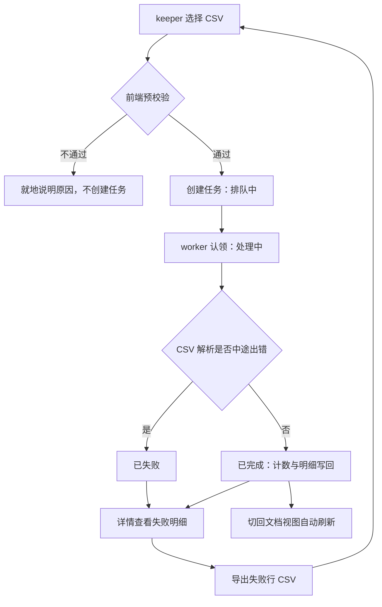

# CSV 导入任务面板

## Summary

在语料管理页内新增「导入任务」视图：keeper 上传 CSV 后即可看到任务从排队到完成的进度，回看历史任务的计数与逐行失败/跳过明细，并把失败行导回本地以便修正后重传。导入能力仍由 morrigan 已上线的异步导入接口提供（commit 81fbb5e），本文档只定义 Calisyn 侧的用户可见行为与范围边界。

---

## Problem Frame

语料库是知识库问答的地基，而维护语料一直需要命令行或直接改库：部署者拿不到一个能自助完成导入的入口，也看不到导入过程中发生了什么。

morrigan 已经把文档导入改造成异步任务：上传 CSV 后由后台串行消费、逐行调用 embedding，任务状态、计数与失败明细都持久化在库里，可随时查询。Calisyn 语料管理页目前只有一个禁用的导入按钮和「异步方案未就绪」的说明——入口看得见，用不了。

缺口带来两类实际损失：能拿到 CSV 的人无法自己完成导入，只能找人上服务器跑命令；导入过程中的行级失败原因不会回到提供 CSV 的人手里，而单次导入的实际耗时由 embedding 逐行决定，这个缺口会一直存在，不会因为等待而消失。

---

## Actors

- A1. keeper（高级权限用户）：发起导入、观察进度、查看失败明细并据此修正 CSV 的部署者。
- A2. 后台导入 worker：morrigan 进程内的串行消费者，认领任务、逐行导入并写回计数、状态与明细。

---

## Key Flows

- F1. 上传导入
  - **Trigger:** keeper 在导入任务视图中选择 CSV 并提交
  - **Actors:** A1, A2
  - **Steps:** 打开上传入口 → 选择单个 CSV → 前端就地校验类型/大小/编码/表头 → 提交创建任务 → 任务以排队中入列 → worker 认领后进入处理中 → 逐行导入并累计计数 → 全部行处理完写入终态
  - **Outcome:** 任务出现在列表顶部并随后端状态推进；不合格文件在提交前被挡下，不产生任务
  - **Covered by:** R2, R4, R5, R6, R7, R8

- F2. 进度跟踪
  - **Trigger:** 列表中存在排队中或处理中的任务
  - **Actors:** A1
  - **Steps:** 页面周期性刷新任务状态 → 停留在任一视图都提示进行中任务 → 任务进入终态时给出一次完成摘要 → 无进行中任务后停止刷新
  - **Outcome:** keeper 不必守着页面，也不会漏掉导入结果
  - **Covered by:** R9, R10, R11, R12

- F3. 回看与排查
  - **Trigger:** keeper 怀疑某次导入有问题，或想确认历史导入结果
  - **Actors:** A1
  - **Steps:** 按状态筛选或翻页定位任务 → 打开详情 → 查看计数与逐行失败/跳过明细 → 需要时导出失败行 CSV → 修正 CSV 后重新上传
  - **Outcome:** 失败行有明确原因且能拿回本地，重传成为可执行动作
  - **Covered by:** R13, R14, R15, R16, R17

- F4. 导入后核对文档
  - **Trigger:** 任务进入终态后 keeper 切回文档视图
  - **Actors:** A1
  - **Steps:** 切换到文档视图 → 列表自动拉取最新数据并回到第一页 → 确认新导入的文档是否在库
  - **Outcome:** 导入结果与文档库状态能对上
  - **Covered by:** R18

---

## Requirements

**入口与权限**

- R1. 语料管理页提供「文档」与「导入任务」两个视图的切换，切换不改变页面路由，也不改变既有 keeper 权限前提。
- R2. 导入任务视图提供「上传 CSV」入口，替代现有禁用占位按钮及其不可用说明。
- R3. 上传、任务列表与任务详情仅 keeper 可用；后端返回 403/401 时给出与既有语料页一致的明确提示（无权限 / 登录过期），不静默失败。

**上传与前置校验**

- R4. keeper 选择单个 CSV 文件后，弹窗展示所选文件名与大小并提供提交与取消；提交成功即关闭弹窗并创建任务。
- R5. 提交前做前端预校验：文件为 CSV、大小不超过后端上限（10 MiB）、内容为 UTF-8、表头为 `title,heading,content`；不合格时就地说明原因且不创建任务。
- R6. 上传入口内提供格式说明（必需表头、字符编码、大小上限，以及「重复行会被跳过而不覆盖已有文档」的语义）与「下载模板」入口，模板仅含表头行。
- R7. 上传失败（网络错误或服务端 4xx/5xx）时保留已选文件与弹窗内容，允许直接重试，并展示服务端返回的原因。

**进度与可见性**

- R8. 任务列表每行展示文件名、状态（排队中 / 处理中 / 已完成 / 已失败）、总行数、成功 / 失败 / 跳过计数、创建时间与完成时间（未完成时留空）。
- R9. 处理中的任务只展示状态与开始时间，不展示行级进度或百分比——后端在任务结束时才写回计数，界面不承诺无法兑现的进度。
- R10. 只有当列表中存在排队中或处理中的任务时，页面才周期性刷新任务状态；没有进行中任务时停止刷新。
- R11. 存在进行中任务时，即使 keeper 停留在文档视图，页面也给出常驻提示，显示进行中任务数量。
- R12. 任务进入终态时给出一次完成摘要（成功 / 失败 / 跳过计数），同一任务不重复提示。

**历史与详情**

- R13. 任务列表默认按创建时间倒序分页，支持按状态筛选（全部 / 排队中 / 处理中 / 已完成 / 已失败），并覆盖空、加载中、加载失败三种状态；加载失败可重试。
- R14. 点击任务打开详情，展示文件名、状态、计数、创建 / 开始 / 完成时间，以及逐行失败与跳过明细（行号、标题、原因）。
- R15. 明细触及后端上限（每任务最多保留 500 条、原因可能被截断）时，界面如实标注「仅展示前 N 条」，不暗示已展示全量。
- R16. 任务记录只读：不提供取消、重试、删除或编辑入口。

**失败明细出口**

- R17. 详情中提供「下载失败行 CSV」，导出可被同一导入入口直接再次使用：含 `title,heading,content` 表头，仅含失败行，不含跳过行。

**导入后核对、呈现一致性与文案**

- R18. 任务进入终态后，keeper 切回文档视图时文档列表自动重新拉取并回到第一页，确保新导入的文档可见。
- R19. 新增文案（入口、上传弹窗与格式说明、状态与计数、错误提示、明细与导出）接入多语言体系，与既有语料页文案口径一致。
- R20. 列表总数（「共 N 条」）展示在表格左下方、与分页同一行的左侧，而不是搜索栏内；文档视图与导入任务视图的位置约定一致。

---

## Acceptance Examples

- AE1. **Covers R2, R4, R7.** keeper 点「上传 CSV」选中 300 行合法文件并提交：弹窗关闭、视图切到导入任务，新任务以「排队中」出现在列表首位；若提交时服务端返回 503，弹窗保留已选文件与错误原因，keeper 可直接重试。
- AE2. **Covers R5.** 选择一个 12 MiB 的 CSV：不创建任务，就地提示超出大小上限；选择表头为 `title,content` 的 CSV：不创建任务，提示缺少必需表头。
- AE3. **Covers R9, R10, R11, R12.** 有 1 个任务处于处理中时，页面周期性自动刷新，任务行只显示状态与开始时间而不显示进度百分比；keeper 切到文档视图仍看到「1 个导入任务进行中」；任务转为已完成时出现一次「98 成功 / 2 失败 / 0 跳过」摘要，之后刷新停止且不重复提示。
- AE4. **Covers R13, R14, R15.** 列表最新任务在最前；按「已失败」筛选后只显示已失败任务；打开某任务详情看到 2 条失败明细，含行号、标题与原因；另一任务明细达上限时标注「仅展示前 500 条」。
- AE5. **Covers R17.** 某任务 100 行中 2 行失败、3 行因 title+heading 已存在被跳过：下载失败行 CSV 得到表头加 2 行数据的文件且可直接再次上传，跳过的 3 行不在文件内。
- AE6. **Covers R3.** 会话失效或非 keeper 调用导入接口返回 401/403 时，页面分别给出「登录已过期」与「无权限」提示，不静默失败。
- AE7. **Covers R18.** 任务完成前文档视图停留在第 2 页；任务完成后切回文档视图，列表回到第一页并出现新导入的文档。
- AE8. **Covers R20.** 打开文档视图：搜索栏内不再出现「共 N 条」，表格下方左侧显示该计数、右侧为分页控件；切到导入任务视图，计数与分页的相对位置保持一致。

---

## Success Criteria

- keeper 不依赖命令行或数据库操作即可完成一次 CSV 导入，并能说清哪些行没进来、为什么。
- 导入期间离开、刷新或切换视图都不会丢失进度判断——任务状态以后端持久化记录为准，不依赖本次会话。
- 前端不再出现禁用或占位式导入入口；ce-plan 拿到本文档后无需再决定产品行为、范围或成功标准。

---

## Scope Boundaries

- 不改动 morrigan 的导入接口、队列行为与并发模型（单实例串行消费）。
- 不做任务管理动作：取消任务、失败行重试或重新提交、删除任务记录、任务历史保留与清理策略。
- 不做完成通知（浏览器通知、站内信、邮件）；完成反馈只发生在语料页内。
- 不支持 CSV 之外的格式（xlsx / json 等），也不支持一次上传多个文件。
- 不建立「某篇文档来自哪次导入」的来源关联或标注。
- 不做导入任务的全局搜索（后端文件名为前缀匹配语义，收益有限），v1 只提供状态筛选与分页。
- 不改变权限模型：沿用现有语料页仅 keeper 可见可达的前提。

---

## Key Decisions

- 导入面板作为语料页内的视图切换，而不是独立路由：导入是语料维护动作的一部分，独立路由会把「上传后核对文档」变成来回跳。
- 进度用页面内轮询，且只在存在排队中或处理中任务时轮询：后端没有推送通道，轮询是当前唯一可用机制；有活动任务才刷新可避免无谓请求。
- 进行中提示挂在页面级而不是任务视图内：keeper 停留在文档视图时同样需要知道后台在跑。
- 处理中不展示行级进度：后端在任务结束时才写回计数，展示百分比只能是假的。
- 失败行导出为 CSV，而不是只做只读明细：后端明确不做失败行重试，导出是修正后重传的唯一闭环；跳过行代表「已存在、无需处理」，因此不进导出。
- 上传前置校验放前端、但以后端为最终判据：减少必然失败的任务，同时保留服务端 400/413 的兜底提示。
- 导入终态后文档列表回到第一页并刷新：避免在旧分页或旧筛选下误以为文档没进来。
- 任务记录只读：后端不提供取消与删除能力，前端不造出后端无法兑现的入口。
- 列表总数统一放表格左下方、与分页同排：搜索栏只承载筛选条件，计数属于结果集信息，两个视图保持同一位置约定。

---

## Dependencies / Assumptions

- 部署的 morrigan 版本包含异步导入接口，且 Calisyn 能经既有 API 前缀访问到它；否则本功能整体不可用（部署前提，不是代码问题）。
- 任务按创建顺序串行执行：同一时间至多一个任务处于处理中，其余排队；页面按状态而非排队位置表达进度。
- 后端只在任务结束时写回计数与明细，处理中无法提供行级进度。
- 后端保证计数满足「总行数 = 成功 + 失败 + 跳过」，界面直接展示，不自行推算或校验。
- 明细条数与原因长度上限由后端强制，前端拿不到全量，因此界面需如实说明。
- 明细条目需带类型标识（失败 / 跳过）：keeper 要区分两者并只导出失败行，而现有明细只有原因文案可依；已确认由 morrigan 侧为明细条目补充类型字段（见计划 U1）。
- 会话接口继续返回 keeper 信号（既有语料页已依赖该前提）。
- 单实例部署下进程重启会恢复未完成任务，因此刷新页面后仍能从后端恢复观察。

---

## Outstanding Questions

### Resolve Before Planning

- 无阻塞项。

### Deferred to Planning

- [Affects R10][Technical] 轮询间隔、最长轮询时长、页面隐藏（后台标签）时是否暂停，以及是否需要手动刷新兜底。
- [Affects R11][Technical] 进行中提示的承载形式（顶部提示条 / 视图标签角标 / 两者），以及最后一个任务完成后提示的消失时机。
- [Affects R12][Technical] 完成摘要的呈现形式，以及如何按任务标识去重，避免多次刷新后重复提示。
- [Affects R4][Technical] 上传的传输方式与上传进度反馈能力（当前请求封装不支持 multipart 与上传进度），以及短耗时上传是否需要真实进度。
- [Affects R5][Technical] 前端 UTF-8 与表头校验的严格程度（BOM、多余列、列顺序）与后端校验口径的对齐方式。
- [Affects R14][Technical] 明细的展示形态（表格 / 列表、长原因截断与展开、默认排序、明细为空时的呈现）。
- [Affects R17][Technical] 失败行 CSV 的客户端生成细节（转义、BOM、换行符）需与后端解析兼容。
- [Affects R1][Technical] 语料页现有单页结构如何容纳视图切换（子组件拆分、切换时的加载与缓存策略）。
- [Affects R18][Technical] 文档列表自动刷新的触发时机（切回文档视图时 / 终态即刻后台刷新）与既有筛选、分页状态的处理。
