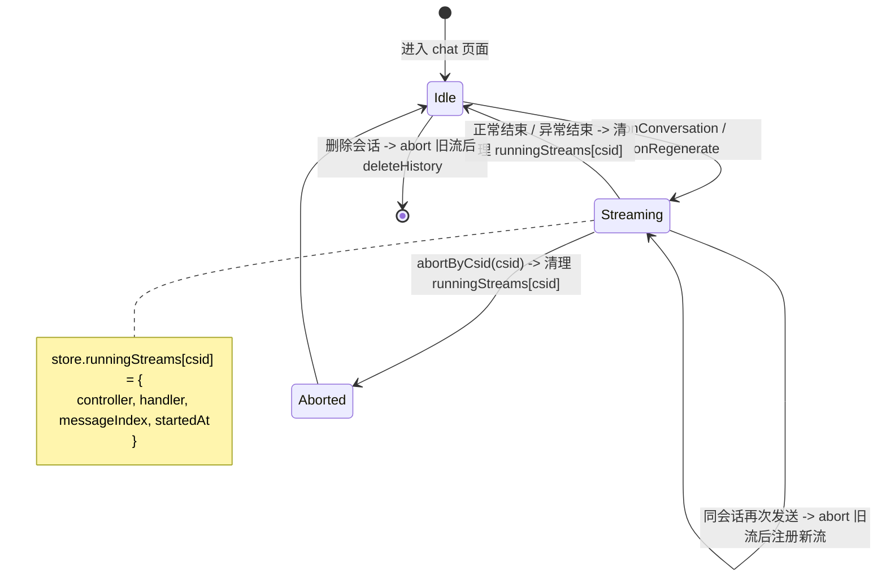

# 修复 SSE 流被 aside 切换覆盖：按会话隔离生成任务

## Summary

在 chat store 中引入“按会话注册进行中 SSE 任务”的运行表，把每条流的 controller、状态变量与占位消息索引都和发起时的 csid 绑定；`createSSEHandler` 写入目标 `currentCsid` 不再读取路由，改为使用流发起时锁定的 `originalCsid`；切换会话、删除会话、再次发送消息时，通过运行表查询并中止目标会话的旧流，确保“切换不串台、并发不互踩、删除先停流、停止只作用于当前会话”。

## Problem Frame

`src/views/chat/index.vue` 的 `createSSEHandler` 在每个 SSE chunk 到来时把 `currentCsid` 重置为 `route.params.csid`（行 74、86、201、254、328），使得“写入目标” 与“展示目标” 共用同一个变量。用户在前一条流尚未结束时通过 `src/views/chat/layout/sider/List.vue` 的 `handleSelect`（行 17-27）切到其他会话，旧请求的后续 chunk 会写入新选中会话的 `chat[].data[]`，导致内容互相覆盖；同一会话再次发送时也只是新建 `AbortController` 而未先取消旧流；删除生成中会话则没有任何清理路径。

## Requirements

- R1. 进行中 SSE 流的内容、loading 状态与停止目标只写入该流发起时的 csid，不受后续路由切换影响。
- R2. 切换到其他会话后，原会话的流继续接收，切回原会话时能看到切走期间继续生成的内容。
- R3. 不同会话允许并发生成；同一会话再次发送时先中止旧流再注册新流。
- R4. “停止生成” 仅中止当前展示会话对应的流；其他后台会话的流不受影响。
- R5. 删除一个仍处于生成中的会话时，先中止该会话对应的流，再移除会话数据；迟到数据不得写入任何会话。
- R6. 流自然结束（含异常）后，会话的 loading 与停止按钮按会话隔离恢复；其他后台会话对应状态不受影响。

**Origin actors:** n/a
**Origin flows:** n/a
**Origin acceptance examples:** AE1 (covers R1, R2), AE2 (covers R1, R4), AE3 (covers R3), AE4 (covers R5), AE5 (covers R6)

## Scope Boundaries

- 不在本次范围：aside 中为后台生成中的会话新增 “生成中” 或 “已完成” 状态提示。
- 不在本次范围：同一会话内多条 SSE 同时生成的场景。
- 不在本次范围：聊天状态管理重构（消息持久化结构、路由结构、LLM provider 改造）。
- 不在本次范围：调整 `service/src/llm/` 任何流式协议或服务端实现。

### Deferred to Follow-Up Work

- 把“同一会话是否生成中” 显式暴露给 aside 列表的 UI 提示：本次先在 store 持有数据，UI 渲染放到独立计划。
- pinia 持久化中针对运行表的字段排除：实施期在 `src/store/modules/chat/helper.ts` 的 `defaultState/getLocalState/setLocalState` 中补 `runningStreams` 的默认空对象，暂不增加 storage 排除配置。

## Context & Research

### Relevant Code and Patterns

- `src/views/chat/index.vue:60-354` `createSSEHandler`：当前是覆盖问题的核心位置。`originalCsid`（行 72）已存在但仅用于一次性 `updateCsid`，应改为写入目标。
- `src/views/chat/index.vue:362-474` `onConversation`、`onRegenerate`：创建 `controller = new AbortController()` 后直接调用 `createSSEHandler`，未先取消同会话的旧流。
- `src/views/chat/index.vue:640-645` `handleStop`：当前只 abort 模块级 `controller`，无法定位到特定会话。
- `src/store/modules/chat/index.ts:5-220`：pinia store 已按 `csid` 索引消息并提供 `getChatByCsid/getChatByCsidAndIndex/updateChatByCsid/updateChatSomeByCsid/deleteHistory/clearChatByCsid`，可复用其 `csid` 索引模式承载运行表。
- `src/store/modules/chat/helper.ts`：持久化 helper 已存在，新增 `runningStreams` 字段需要保持向后兼容（默认空对象）。
- `src/views/chat/layout/sider/List.vue:17-27` `handleSelect`：仅调用 `setActive`（含 `updateHistory` + `router.push` 隐含于 store action），未取消任何进行中流；删除路径 `handleDeleteDebounce`（行 33-40）调用 `chatStore.deleteHistory`。
- `src/api/index.ts:57-205` `fetchChatStream`：客户端不动，仅消费其返回的 `{ close }` 接口。

### Institutional Learnings

- `docs/solutions/` 目录当前不存在，没有相关历史学习。
- 历史 plan `2026-03-29-001-refactor-multi-provider-chat-sse-plan.md` 涉及后端 SSE 协议，本次不修改其结论，仅复用其“流式协议不需改” 的隐含基线。

### External References

- 未触发外部研究：仓库已有 vitest + jsdom（`vitest.config.ts:1-29`），可覆盖运行表与 store action 的单测；SSE 协议与 `AbortController` 行为属于 Web 标准，无新风险。

## Key Technical Decisions

- **运行表位置选 store state 而非组件作用域**：删除会话与跨视图恢复都依赖全局可见的状态；放 store 后 `setActive`/`deleteHistory` 等已有 action 都能直接查询并 abort。
- **运行表只入运行时内存，不进 localStorage**：刷新页面时残留的 controller 失效，避免恢复后持有“僵尸”流；消息数据本身已由既有 store 持久化覆盖。
- **写入目标在流发起时锁定为 `originalCsid`**：`createSSEHandler` 内不再读取 `route.params.csid`；`addChat` 与 `updateChat` 一律使用 `originalCsid`，与 `updateCsid` 一次性回写策略一致。
- **停止按钮可见性走 store getter**：视图层通过 `chatStore.getRunningByCsid(currentCsid)` 判定是否展示停止按钮与 loading 态，避免组件局部 `loading` 误反映后台流。
- **同会话再次发送走 store action 内的查表+abort 路径**：复用既有 “新请求替换旧请求” 语义，但把“先中断旧流” 显式化，不再依赖 UI 入口的 `if (loading.value) return` 兜底（该分支只覆盖当前组件实例，跨视图/同一会话的并发会被漏掉）。

## Open Questions

### Resolved During Planning

- 是否复用 `chatStore.updateCsid` 的一次性回写策略：保留，第一次响应头更新 `originalCsid` 为新 csid 后，后续 chunk 仍沿用 `originalCsid` 写入。
- 视图 `loading` 是否完全交给 store：保留组件 `loading` 作为本视图的“是否在生成” 标记，但 `handleStop` 改为调用 store 的 `abortByCsid(csid.value)`，组件 `loading` 仍然切换。

### Deferred to Implementation

- `runningStreams` 字段的 TypeScript 类型精确结构（Map<object> vs. 索引对象）。
- 视图组件 `loading` ref 与 store 运行表的状态同步时机：避免在并发流场景下出现本视图“看似停止” 但其他视图仍可见生成态的偏差。
- `updateCsid` 一次性回写后，是否需要同步迁移 `runningStreams[oldCsid]` 到 `runningStreams[newCsid]`：倾向于迁移，实施期按运行时行为确认。

## High-Level Technical Design

> *Directional guidance for review, not implementation specification. The implementing agent should treat the diagram as context, not code to reproduce.*

## Implementation Units

### U1. 在 chat store 引入运行表与查询/操作 action

**Goal:** 为每条进行中的 SSE 流提供按 csid 索引的注册、查询与中止能力，是后续单元使用的基础。

**Requirements:** R1, R2, R3, R4, R5, R6

**Dependencies:** None

**Files:**
- Modify: `src/store/modules/chat/index.ts`
- Modify: `src/store/modules/chat/helper.ts`
- Modify: `src/typings/chat.d.ts`
- Create: `src/store/modules/chat/index.test.ts`

**Approach:**
- 在 `ChatState` 增加 `runningStreams: Record<string, RunningStreamEntry>`，默认 `{}`；`RunningStreamEntry` 包含 `controller`、`messageIndex`、`startedAt`、`cancelled: boolean`，可选保留 `close` 引用；`chat.d.ts` 中显式声明该类型。
- 新增 `registerStream(csid, entry)`、`unregisterStream(csid)`、`getRunningByCsid(csid)`、`abortByCsid(csid)`、`migrateStreamEntry(oldCsid, newCsid)` 五个 action：
  - `registerStream` 同 csid 已存在时先 `abort` 旧 entry 再覆盖（实现 R3）。
  - `abortByCsid` 设置 `entry.cancelled = true` → 调用 `entry.controller.abort()` → `unregisterStream`；U2 在 `handleMessage` 入口检查 `cancelled` 提前 return，杜绝 abort 后的迟到 chunk 写入新 active csid。
  - `migrateStreamEntry` 由 U2 在 `chatStore.updateCsid` 回调内调用，把 `runningStreams[oldCsid]` 同步到 `runningStreams[newCsid]`。
- 持久化 helper 中把 `runningStreams` 视为运行时字段，刷新后初始为空；`recordState` / `setLocalState` 在写入前过滤掉该字段（避免 AbortController 实例走 `JSON.stringify` 退化），具体做法由实施期在 `src/store/modules/chat/helper.ts` 的 `setLocalState` 与 `src/utils/storage/index.ts` 的 `ss.set` 之间选其一（推荐在 store 层过滤）。

**Execution note:** 单元测试先行：先在 `src/store/modules/chat/index.test.ts` 写“注册→查询→中止→再注册” 的状态断言，作为该 unit 的回归保护。

**Patterns to follow:**
- 既有 `addChatByCsid / updateChatByCsid / getChatByCsid` 的 “by csid 索引” 风格。
- 既有 `recordState` 在状态变更后的调用模式。

**Test scenarios:**
- Happy path: `registerStream` 后 `getRunningByCsid` 返回对应 entry；`unregisterStream` 后返回 `undefined`。
- Edge case: 同一 csid 连续两次 `registerStream` 时，第一次 entry 的 `controller.abort` 被调用。
- Error path: 对未注册 csid 调用 `abortByCsid` 不会抛错。
- Integration: 在 pinia setup 中调用 `setActive` 不影响 `runningStreams` 完整性。

**Verification:**
- 单元测试通过 `pnpm test -- src/store/modules/chat/index.test.ts`。
- 手动在 store devtools 验证运行表项随 `register/unregister` 出现与消失。

---

### U2. 重构 `createSSEHandler`，锁定写入目标为发起会话

**Goal:** 让 `createSSEHandler` 内部的 `currentCsid` 不再读取路由，固定使用 `originalCsid`，并在流自然结束与异常结束时清理运行表。

**Requirements:** R1, R2, R6

**Dependencies:** U1

**Files:**
- Modify: `src/views/chat/index.vue`

**Approach:**
- 把 `currentCsid` 的所有读取（包括行 74、86、201、254、328）改为固定使用 `originalCsid`；`originalCsid` 在 `updateCsid` 触发后改为 `newCsid`（不再清空），确保后续 chunk 的 `addChatByCsid` / `updateChatByCsid` 落到新 csid 的 chat 桶。
- 替换 `data.csid` 一次性回写为：`updateCsid` 触发后用 `chatStore.migrateStreamEntry(originalCsid, newCsid)` 同步运行表，避免被旧 entry 的 abort 标记误命中。
- 在 `onConversation` / `onRegenerate` 内 `const controller = new AbortController()`（替换模块级 `let controller`），调用 `chatStore.registerStream(csid.value, { controller, messageIndex, startedAt, cancelled: false })`；在 `finally` 块与异常分支内 `chatStore.unregisterStream(originalCsid)`。
- `handleMessage` 入口读取 `chatStore.getRunningByCsid(originalCsid)`，若 `entry.cancelled` 为 `true` 则直接 return，保证 abort 后的迟到 chunk 不再写入任何 csid。
- 长回复 (`openLongReply` + `data.finishReason === 'length'`) 的循环在 `fetchWithLongReply` 内一次注册、整轮保留：`registerStream` 在循环外调用一次，每个 `fetchChatStream` 周期不重新注册；`unregisterStream` 在 `finally` 内调用一次。
- `onUnmounted`（行 696-699）移除对模块级 `controller` 的 abort 调用，改为：若 `chatStore.getRunningByCsid(csid.value)` 仍存在且 csid 等于当前路由的 csid（即真正的页面销毁而非跨会话切换），再 `abortByCsid`；跨会话切换由 `Layout.vue:44` 触发 `RouterView` remount 时 csid 已变化，命中“会话不同” 分支从而**不** abort，后台流继续。

**Patterns to follow:**
- 既有 `originalCsid` 变量与 `updateCsid` 调用点。
- 既有 `finally` 块的清理模式（`loading.value = false; handler?.close()`）。

**Test scenarios:**
- Happy path: 模拟 `createSSEHandler` 多次调用 `onMessage`，断言 `chatStore.updateChatByCsid` 始终使用发起 csid。
- Edge case: 切换路由后再到达 chunk 不会写入新选中 csid（通过 mock `useRoute` 验证）。
- Error path: 触发 `AbortError` 时 `unregisterStream` 被调用。

**Verification:**
- 视图层手动验证：会话 A 切到 B 切回 A，A 消息完整；B 不含 A 内容。
- 单元测试覆盖 `createSSEHandler` 的“写入目标始终为 originalCsid” 行为（可通过将 handler 拆出函数或注入依赖实现）。

---

### U3. `handleStop` 改为按当前 csid 中止流

**Goal:** 停止按钮只影响当前展示会话对应的流，跨会话并发场景下不误中止后台流。

**Requirements:** R4

**Dependencies:** U1, U2

**Files:**
- Modify: `src/views/chat/index.vue`

**Approach:**
- `handleStop` 调用 `chatStore.abortByCsid(csid.value)`，并保留对组件 `loading.value` 的同步。
- 视图渲染中“正在生成”、“停止按钮” 可见性以及 `buttonDisabled`（行 679-681）均改为 `chatStore.getRunningByCsid(csid.value)`，保证跨视图一致：跨视图 remount 后视图 `loading.value` 默认为 `false`，需要从运行表重新求值。
- 模块级 `controller = new AbortController()` 在 U2/U5 中被替换为每个 `onConversation` / `onRegenerate` 调用内的局部 `const controller`，由 store 持有运行时归属；`handleStop` 的兜底改为在 `loading.value` 为真且 store 中无对应 entry 时调用模块级 controller。

**Test scenarios:**
- Happy path: 模拟 A、B 两个 csid 各自注册 entry，对 A 调用 `abortByCsid(A)` 后 B 的 entry.controller 仍 `signal.aborted === false`。
- Edge case: 当前 csid 没有进行中流时点击停止按钮不抛错。

**Verification:**
- 手动并发测试：会话 A、B 同时生成，在 B 页面点击停止 → A 继续；切回 A 看到内容持续追加。

---

### U4. 删除生成中会话的“先停后删” 路径

**Goal:** aside 删除仍在生成的会话时，先中止流再移除数据，杜绝迟到 chunk 命中已删除的 csid。

**Requirements:** R5

**Dependencies:** U1

**Files:**
- Modify: `src/store/modules/chat/index.ts`

**Approach:**
- `deleteHistory(index)` 在 `splice` 之前判断目标 csid 是否在 `runningStreams` 中，若是则调用 `abortByCsid(csid)` 再继续原删除流程。
- 删除完成后确保 `runningStreams[csid]` 已被清理（`abortByCsid` 已包含 unregister）。

**Test scenarios:**
- Happy path: 注册 entry 后 `deleteHistory` 触发 `controller.abort` 并清理 `runningStreams`。
- Error path: entry 不存在时删除流程不抛错。

**Verification:**
- 手动验证：会话 A 生成中删除 A，UI 不再出现 A 的消息；流被关闭，无后续内容追加。

---

### U5. 同会话再次发送的“先中断旧流” 语义

**Goal:** 同一会话内再次发起 SSE 时，先中止上一次注册在同一 csid 的流，再注册新流，实现“新请求替换旧请求” 的显式语义。

**Requirements:** R3

**Dependencies:** U1, U2

**Files:**
- Modify: `src/views/chat/index.vue`

**Approach:**
- `onConversation` / `onRegenerate` 在 `registerStream` 之前先调用 `chatStore.abortByCsid(csid.value)` 一次（store 内部 `registerStream` 也会兜底）。
- 保留 `if (loading.value) return` 兜底，避免双击产生两个 “thinking” placeholder；跨视图/跨实例的并发场景由 U1 的 `registerStream` abort-on-duplicate 兜底。该 guard 与新流程并存，guard 失败时仍走 store abort 路径。

**Test scenarios:**
- Happy path: 同一 csid 连续两次 `onConversation`，第一次的 entry.controller 被 abort，第二次 entry 仍能正常注册。
- Edge case: 第一次流已自然结束时，第二次 `abortByCsid` 不抛错。

**Verification:**
- 手动测试：会话 A 连续点击两次发送按钮，仅出现一条助手回复（最新的），旧流被中止。

## System-Wide Impact

- **Interaction graph:** `src/views/chat/layout/sider/List.vue:17-27` 仍只调 `setActive`，无需感知运行表；删除路径 `handleDeleteDebounce` → `deleteHistory` 由 U4 在 store 内统一处理。
- **Error propagation:** `AbortError` 路径仍由既有 `catch` 块消费（`error.name === 'AbortError' || error.message === 'canceled'`）；`unregisterStream` 在 `finally` 与异常分支均会触发，确保不会残留。
- **State lifecycle risks:** `runningStreams` 始终与 `controller.signal` 生命周期配对；`updateCsid` 迁移路径是新增风险点；U2 `handleMessage` 入口的 `cancelled` 检查覆盖 abort 后的迟到事件。`clearHistory` 之前会先 `abortAll()` 全部流，避免已注册的 controller 在 state 重置后继续写入。
- **API surface parity:** `src/api/index.ts` 不变；后端 SSE 协议不变。
- **Integration coverage:** 单元测试覆盖 store 状态机；组件层靠手测覆盖（仓库内无 e2e 基础）。
- **Unchanged invariants:** `getChatByCsid` / `updateChatByCsid` 等既有 API 不变；`addHistory` / `setActive` / `reloadRoute` 行为不变；持久化 `chat` / `history` 形状不变。

## Risks & Dependencies

| Risk | Mitigation |
|------|------------|
| `updateCsid` 一次性回写时 `runningStreams[oldCsid]` 迁移遗漏 | U1 在 `registerStream` 与 `updateCsid` 配合中显式迁移；U2 测试覆盖 `originalCsid` 切换后 chunk 仍走新 csid。 |
| 视图 `loading` 与 store 运行表不同步导致“看似停止” | U3 把渲染入口改为 `getRunningByCsid(csid.value)`，组件 `loading` 仅作新请求互斥信号。 |
| `runningStreams` 误入 localStorage 导致刷新后持有僵尸流 / `JSON.stringify` 对 AbortController 退化 | U1 在 `setLocalState` 入口过滤 `runningStreams`（保留其他字段），刷新后 `getLocalState` 走 `defaultState` 的 `{}` 覆盖；`recordState` 因此不序列化 `runningStreams`。 |
| 删除生成中会话的清理顺序倒置导致迟到 chunk 写入选中会话 | U4 在 `splice` 之前先 abort；store 端 abort 设置 `cancelled=true` 同步 unregister；U2 在 `handleMessage` 入口检查 `cancelled` 提前 return，覆盖 `sse.js` 事件队列残留。 |
| 长回复循环的 `runningStreams` 重新挂载遗漏 | U2 的实施期点出该点；测试覆盖 `data.finishReason === 'length'` 场景。 |

## Documentation / Operational Notes

- 行为变更已记录在 origin 需求文档中；本 plan 不新增用户文档。
- `pnpm test` 增加 `src/store/modules/chat/index.test.ts`；CI 中已包含 `pnpm test` 入口，无需新增。
- 若未来需要把“生成中” 状态暴露给 aside UI，单独计划读取 `runningStreams` 即可。

## Sources & References

- **Origin document:** [docs/brainstorms/2026-07-14-isolate-sse-stream-by-conversation-requirements.md](../brainstorms/2026-07-14-isolate-sse-stream-by-conversation-requirements.md)
- Related code: `src/views/chat/index.vue`, `src/store/modules/chat/index.ts`, `src/views/chat/layout/sider/List.vue`, `src/api/index.ts`
- Related PRs/issues: n/a
- External docs: n/a
