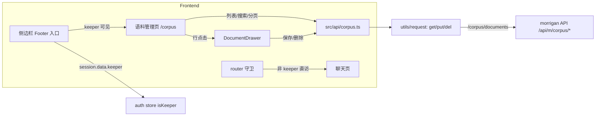

# 语料文档管理面板

## Summary

为 Calisyn 前端新增一个仅高级权限用户（会话 `data.keeper === true`）可见/可达的独立语料管理页面：分页浏览、关键词搜索、抽屉内查看与编辑、二次确认删除，以及 CSV 导入占位入口。前端只消费 morrigan f09ab7a 已提供的 corpus Web API（`GET/PUT/DELETE /corpus/documents`），不改动后端 API 本体。

## Problem Frame

语料库目前只能靠命令行或直接操作数据库维护，部署者无法在线查看、核对与修正文档。本计划把 morrigan 的 corpus API 接到前端，让 keeper 用户在聊天应用内完成浏览/搜索/查看/编辑/删除，降低错误文档的修正成本。

## Requirements

来源：`docs/brainstorms/2026-08-24-corpus-document-management-requirements.md`（以下引用为 `(see origin: ...)`）。

| ID | 内容 | 落地单元 |
| --- | --- | --- |
| R1 | 独立语料管理页面路由 + 侧边栏底部图标入口 | U4, U5 |
| R2 | 入口与路由仅 keeper 可见/可达，普通用户直访引导回聊天页 | U1, U4 |
| R3 | 编辑/删除按钮仅 keeper 显示，与后端 403 兜底一致 | U1, U6, U7 |
| R4 | 403/401 明确错误提示，不静默失败 | U2, U6, U7 |
| R5 | 列表：标题/小节/内容摘要/更新时间 + 分页 + 总数 | U6 |
| R6 | 关键词同时匹配标题、小节、内容 | U6 |
| R7 | 后端允许字段排序（id/created/updated/heading） | U6 |
| R8 | 空/加载中/加载失败状态 | U6 |
| R9 | 点击行开抽屉：完整内容 + 元信息，长文本可滚动 | U7 |
| R10 | 抽屉内编辑标题/小节/内容并保存，失败保留编辑内容 | U7 |
| R11 | 删除二次确认，成功后从列表移除 | U7 |
| R12 | CSV 导入占位按钮（不可用并说明原因） | U6 |
| R13 | 文案接入多语言体系 | U8 |
| R14 | 复用现有请求封装与错误处理模式 | U2, U3 |

**Origin actors:** A1 高级权限用户（keeper）、A2 普通登录用户。
**Origin flows:** F1 浏览与搜索（R1/R5/R6/R7）、F2 查看并编辑（R9/R10）、F3 删除（R11）、F4 CSV 导入占位（R12）。
**Origin acceptance examples:** AE1（R2 直访重定向）、AE2（R3/R4 权限按钮与 403 提示）、AE3（R6 关键词过滤与清空恢复）、AE4（R9/R10 抽屉编辑保存与失败保留）、AE5（R11 删除确认/取消）、AE6（R12 导入占位）。

## Scope Boundaries

沿用 origin 的边界：
- 不做手动“新建文档”表单（后端无 create 端点，新增统一走 CSV 导入）。
- 不做 CSV 导入的完整交互（上传/预览/进度/结果），等后端异步方案确定后补。
- 不做 CSV 导出或模板下载。
- 不改动 morrigan 后端 corpus API 本体（`corpus.yaml` 的 R/U/D 已够用）。

### Deferred to Follow-Up Work

- 前端 `/api` 到 morrigan 的连通方式（直连或经 Express 转发）：本计划按“前端请求相对路径 `/corpus/*`、部署方确保 API 前缀能到达 morrigan” 设计（当前 `.env` 中 `VITE_API_PATH=/api/m`、`VITE_API_PROXY_TO=http://127.0.0.1:3002` 指向 morrigan 即满足）。如需在 Calisyn Express 服务里增加 `/corpus` 反代，另行评估。
- 关键词搜索的“包含”语义与 OR 语义的服务器端支持（见 Open Questions）。

## Context & Research

### morrigan corpus API 契约（已核实源码）

- 路由（`pkg/web/api/handle_corpus_gen.go`，挂载于 `settings.Current.APIPrefix`，本地为 `/api/m`）：
  - `GET /corpus/documents`：查询列表。
  - `GET /corpus/documents/:id`：详情（本计划未使用，列表已含完整 content）。
  - `PUT /corpus/documents/:id`：更新，body 为 `corpus.DocumentSet`（`title`/`heading`/`content` 均为可选字符串）。
  - `DELETE /corpus/documents/:id`：删除。
- 列表 query 参数（`stores.CobDocumentSpec`）：`page`、`limit`、`skip`、`sort`，字段过滤 `title`/`heading`/`content`（`pgx.SiftMatch` → `ILIKE`，默认前缀匹配、多字段间为 AND），`sort` 支持 `field [asc|desc]`、逗号分隔或 `-field`，白名单 `id/created/updated/heading`（`pgx.ModelSpec.CanSort` + `corpus_gen.go` 追加 heading）。
- 响应信封（`resp.Done`/`resp.ResultData`）：成功为 `{ "status": 0, "result": { "data": [...], "total": N } }`（列表）或 `{ "status": 0, "result": "ok" }`（更新/删除）；失败为 4xx/5xx + `{ "status": ..., "message": ... }`。
- 文档字段：`id`、`title`、`heading`、`content`、`createdAt`、`updatedAt`、`creatorID`、`meta`（`comm.DefaultModel` + `DocumentBasic`）。
- 会话：`GET /session` 返回 `{ "status": "Success", "data": { ..., "keeper": bool } }`（`handle_user.go` 的 `fillUserResponse` 用 `stores.UserIsKeeper(user)` 填充）。

**关键发现 1：列表接口不支持跨字段 OR 关键词搜索。** 生成代码把 `title`/`heading`/`content` 三个过滤条件 AND 在一起，且 `SiftMatch` 默认只做前缀匹配（`CleanWildcard` 会去掉前导通配符；`DB_ALLOW_LEFT_WILDCARD` 未开启时无法用 `%kw%` 做包含匹配）。R6/AE3 要求“标题、小节或内容中包含该词”。方案：关键词非空时并行发 3 个请求（各字段各搜一次，`limit` 取上限），前端合并去重、按更新时间倒序、客户端分页；关键词为空时走服务器分页/排序。限制：合并搜索的 total 受单请求上限约束（3 × 200），超大语料库的搜索分页非精确，作为 v1 明确妥协并记录。

**关键发现 2：现有请求封装缺少 DELETE，且错误信息丢失。** `src/utils/request/index.ts` 有 `get/post/patch/put`，`http()` 未实现 DELETE 分支（会落到 `request.post`）；`failHandler` 用 axios 的通用 `error.message`（如 “Request failed with status code 403”）丢弃了服务端 `message` 与 `status`，无法满足 R4 的明确错误提示。

**关键发现 3：`Layout.vue` 挂载时强制 `router.replace({ name: 'Chat' })`。** 语料页若作为 Root 布局的子路由，直访 `/corpus` 会被该 replace 弹回聊天页。需在 Layout 挂载逻辑中跳过非 Chat 子路由。

### 前端现有模式

- 路由：`src/router/index.ts` 的 Root 布局（`ChatLayout`）children 下追加 `/corpus` 懒加载路由；`src/router/permission.ts` 的 `beforeEach` 在会话加载后追加 keeper 判断。
- 请求：`src/api/index.ts` + `src/utils/request/index.ts`（axios 封装、token 注入、401 处理）；语料接口新建 `src/api/corpus.ts` 复用 `get/put/del`。
- 会话/权限：`src/store/modules/auth/index.ts` 的 `SessionResponse` 增加 `keeper?: boolean`，新增 `isKeeper` getter；侧边栏底部 `src/views/chat/layout/sider/Footer.vue` 增加入口按钮。
- UI：naive-ui（`NDataTable/NDrawer/NPagination/NInput/NButton/NAlert/NText/useDialog/useMessage`）；图标用 `@iconify/vue` 的 `ri:*`（SvgIcon 组件）。
- i18n：`src/locales/*.ts` 七个语言文件，新增 `corpus` 文案块。

### Institutional Learnings

- `docs/solutions/` 不存在；`docs/todos/` 中无与本功能相关的既有结论。
- 历史计划 `2026-03-29-002-feat-add-mcp-client-registry-plan.md` 等均遵循“需求文档 → `docs/plans/` 计划 → 前端实现” 的流程，本计划沿用。

## Key Technical Decisions

- **keeper 信号只读会话 `data.keeper`**：`SessionResponse` 增加字段 + `isKeeper` getter，入口可见性与路由守卫、按钮显隐统一用它（R2/R3）。后端 403 仍做兜底提示（R4）。
- **语料页作为 Root 布局子路由 + Layout 跳过强制 replace**：保留侧边栏应用外壳；`Layout.vue` 挂载时仅当当前路由不是语料页才 `replace` 到 Chat，直访由权限守卫把关（R1/R2）。
- **搜索走“并行三字段 + 前端合并”**：不动后端，满足 AE3 的可接受近似；空关键词恢复服务器分页（R6）。
- **请求封装只做增量扩展**：`http()` 增加 DELETE 分支与 `del` 导出；`failHandler` 保留服务端 `message` 并附带 `status`/`response`（不改变既有调用方语义，R14）。
- **抽屉编辑状态放抽屉组件本地**：打开时从行数据初始化；保存失败不清空本地编辑值并 toast 错误（R10）；删除用 `useDialog` 二次确认（R11）。

## Implementation Units

### U1. 会话类型与 keeper 权限信号

**Goal:** 前端能读取会话 `data.keeper`，为入口/守卫/按钮提供统一权限源。

**Requirements:** R2, R3

**Dependencies:** None

**Files:**
- Modify: `src/store/modules/auth/index.ts`
- Create: `src/store/modules/auth/index.test.ts`

**Approach:**
- `SessionResponse` 增加 `keeper?: boolean`；新增 getter `isKeeper`（`state.session?.keeper ?? false`）。
- 单测：构造不同 session 断言 `isKeeper`。

**Test scenarios:**
- Happy path: session 缺省时 `isKeeper === false`。
- Edge case: `session.keeper === true` 时 `isKeeper === true`；session 为 null 时不抛错。

**Verification:** `pnpm test -- src/store/modules/auth/index.test.ts`。

---

### U2. 请求封装：DELETE 支持与错误信息保留

**Goal:** corpus API 能发 DELETE；4xx/5xx 时保留服务端 message 与 HTTP status。

**Requirements:** R4, R14

**Dependencies:** None

**Files:**
- Modify: `src/utils/request/index.ts`
- Modify: `src/utils/request/index.test.ts`

**Approach:**
- `http()` 增加 `if (method === 'DELETE') return request.delete(url, { params, headers, signal, onDownloadProgress }).then(...)`；新增 `del()` 导出（签名与 `get/post/patch/put` 一致）。
- `failHandler` 改为：优先取 `error?.response?.data?.message`，其次 `error?.message`；抛出 `new Error(message)` 并挂载 `status` 与 `response`。
- 更新既有测试：DELETE 由“走 POST” 改为“走 request.delete”；新增 `del` 导出断言与错误信息透传用例。

**Test scenarios:**
- Happy path: `del({url})` 调用 `request.delete(url, {params, headers, signal, onDownloadProgress})`。
- Error path: 服务端 403 返回 `{message: '无权限'}` 时，reject 的 Error.message 为 `无权限` 且 `.status === 403`。
- Regression: GET/POST/PATCH/PUT 路由行为不变。

**Verification:** `pnpm test -- src/utils/request/index.test.ts`。

---

### U3. corpus API 层

**Goal:** 提供类型化的列表/更新/删除函数，复用现有封装。

**Requirements:** R5, R10, R11, R14

**Dependencies:** U2

**Files:**
- Create: `src/api/corpus.ts`
- Create: `src/api/corpus.test.ts`

**Approach:**
- 类型：`CorpusDocument { id; title; heading; content; createdAt?; updatedAt?; creatorID?; meta? }`；查询参数 `{ page?; limit?; sort?; title?; heading?; content? }`。
- 函数：
  - `fetchCorpusDocuments(params)` → `get` `/corpus/documents`，返回体 `{ status; result?: { data; total } }`。
  - `updateCorpusDocument(id, { title?; heading?; content? })` → `put` `/corpus/documents/:id`。
  - `deleteCorpusDocument(id)` → `del` `/corpus/documents/:id`。
- 单测：mock `@/utils/request`，断言 URL、方法、参数。

**Test scenarios:**
- Happy path: 列表函数把 `{ page, limit, sort, title }` 原样传给 `get` 且 URL 为 `/corpus/documents`。
- Happy path: 更新函数以 `PUT` 发送 `/corpus/documents/:id` 与 body。
- Happy path: 删除函数以 `DELETE` 发送 `/corpus/documents/:id`。

**Verification:** `pnpm test -- src/api/corpus.test.ts`。

---

### U4. 路由、权限守卫与布局微调

**Goal:** `/corpus` 路由仅 keeper 可达；直访时普通用户被引导回聊天页；keeper 直访不弹回。

**Requirements:** R1, R2

**Dependencies:** U1

**Files:**
- Modify: `src/router/index.ts`
- Modify: `src/router/permission.ts`
- Modify: `src/views/chat/layout/Layout.vue`
- Create: `src/router/permission.test.ts`

**Approach:**
- `router/index.ts`：Root children 追加 `{ path: '/corpus', name: 'Corpus', component: () => import('@/views/corpus/index.vue') }`。
- `permission.ts`：会话加载完成（或已有 session）后，若 `to.name === 'Corpus' && !authStore.isKeeper` → `next({ name: 'Chat' })`；其余逻辑不变。
- `Layout.vue`：挂载时 `router.replace({ name: 'Chat', ... })` 增加条件 `if (route.name !== 'Corpus')`。
- 守卫单测：memory router + pinia（复用 `@/store/helper` 单例），keeper=false 时 push `/corpus` 落在 Chat；keeper=true 时落在 Corpus。

**Test scenarios:**
- Happy path: session.keeper=false 直访 `/corpus` → 重定向 Chat。
- Edge case: session.keeper=true 直访 `/corpus` → 停在 Corpus。
- Regression: 正常 `/chat/:csid` 访问不受影响。

**Verification:** `pnpm test -- src/router/permission.test.ts`。

---

### U5. 侧边栏底部入口

**Goal:** keeper 用户从侧边栏底部看到语料入口并可进入。

**Requirements:** R1, R2, R3

**Dependencies:** U1, U4

**Files:**
- Modify: `src/views/chat/layout/sider/Footer.vue`

**Approach:**
- 在设置按钮旁新增 `HoverButton`，`v-if="authStore.isKeeper"`，图标 `ri:book-open-line`，tooltip 用 `t('corpus.entry')`；点击 `router.push('/corpus')`，移动端先折叠 sider。

**Test scenarios:**
- 手动：keeper 会话下侧边栏底部出现入口，点击进入语料页；普通用户会话下不显示。
- 手动：移动端点击入口后侧边栏收起并进入语料页。

**Verification:** 手动验证（组件依赖 store/路由，单测收益低）。

---

### U6. 语料管理页（列表、搜索、分页、状态）

**Goal:** 提供列表浏览、关键词搜索、分页/排序、空/加载/失败状态与导入占位。

**Requirements:** R5, R6, R7, R8, R12

**Dependencies:** U1, U3

**Files:**
- Create: `src/views/corpus/index.vue`
- Create: `src/views/corpus/utils.ts`
- Create: `src/views/corpus/utils.test.ts`

**Approach:**
- 页面状态：`keyword`（输入防抖 300ms）、`page`、`pageSize = 20`、`sort`（默认 `updated desc`）、`loading`、`error`、`rows`、`total`。
- 加载逻辑：
  - 关键词为空 → `fetchCorpusDocuments({ page, limit, sort })`，服务器分页。
  - 关键词非空 → `Promise.all` 三路 `{ title, heading, content }`（各自 `limit: 200`），`mergeCorpusSearch` 合并去重、按 `updatedAt ?? createdAt` 倒序，客户端分页。
- 表格：`NDataTable`，列：标题、小节（heading）、内容摘要（`NText` ellipsis tooltip）、更新时间（`toLocaleString`）、操作（编辑/删除，仅 keeper）；行点击开抽屉（U7），操作按钮 `@click.stop`。
- 排序：`updatedAt`/`createdAt`/`heading` 三列 `sorter`，单字段受控；空关键词时转成服务器 `sort` 参数（`updated`/`created`/`heading`），搜索时客户端排序。
- 状态：`NDataTable` loading；空数据用 empty 插槽；失败用 `NAlert` + 重试按钮；403/401 错误按 `error.status` 映射 i18n 文案（R4）。
- 导入占位：禁用 `NButton` + tooltip 说明后端异步方案未就绪（R12）。
- `utils.ts` 导出纯函数 `mergeCorpusSearch`（去重+排序）与 `paginate`（客户端分页），供单测。

**Test scenarios:**
- Happy path（utils）：三路结果含重复 id 时去重，按 updatedAt 倒序。
- Edge case（utils）：updatedAt 缺失时回退 createdAt/0；空数组合并返回空。
- Happy path（utils）：`paginate` 按 page/pageSize 正确切片并返回 total。
- 手动：空列表/加载中/请求失败（断网或 500）三种状态可见；关键词输入防抖后列表过滤，清空恢复全量。

**Verification:** `pnpm test -- src/views/corpus/utils.test.ts` + 手动状态验证。

---

### U7. 抽屉：详情、编辑、保存、删除

**Goal:** 行点击展示完整内容与元信息；keeper 可编辑保存、二次确认删除。

**Requirements:** R9, R10, R11, R4

**Dependencies:** U1, U3

**Files:**
- Create: `src/views/corpus/components/DocumentDrawer.vue`

**Approach:**
- `NDrawer`（右滑，桌面 720px / 移动端 100%）：顶部展示标题与元信息（创建/更新时间），内容区 `NInput type="textarea"`（autosize，最小 10 行）可滚动。
- 编辑：本地 `form` ref 在 `document` 变化时重置；保存调用 `updateCorpusDocument`，成功 emit `saved(updated)` 并关闭；失败保留 `form` 内容、`useMessage` 提示（403 → `corpus.permissionDenied`，401 → `corpus.authExpired`，其余 `corpus.saveFailed`）。
- 删除：`useDialog.warning` 二次确认 → `deleteCorpusDocument` → emit `deleted(id)` 并关闭；取消无副作用。

**Test scenarios:**
- 手动：点击行打开抽屉，长文本可滚动；修改标题保存后列表行即时更新。
- 手动：后端失败（mock 403）时抽屉保留编辑内容并提示权限错误；401 提示重新登录。
- 手动：删除确认弹窗，确认后行消失；取消无变化。

**Verification:** 手动验证（组件集成度高，与 U6 一起在 dev server 走查）。

---

### U8. 多语言文案

**Goal:** 语料页/入口/抽屉文案接入全部语言。

**Requirements:** R13

**Dependencies:** U5, U6, U7

**Files:**
- Modify: `src/locales/zh-CN.ts`
- Modify: `src/locales/en-US.ts`
- Modify: `src/locales/zh-TW.ts`
- Modify: `src/locales/es-ES.ts`
- Modify: `src/locales/ko-KR.ts`
- Modify: `src/locales/ru-RU.ts`
- Modify: `src/locales/vi-VN.ts`

**Approach:**
- 每个文件新增 `corpus` 块：页面标题、入口 tooltip、搜索占位、导入占位与原因、总数、空/失败/重试、权限/登录提示、列名、抽屉元信息、保存/删除提示（含 `{total}` 插值）。

**Test scenarios:** 手动切换语言（zh-CN/en-US 至少）检查文案渲染。

**Verification:** `pnpm type-check` + 手动切换。

---

## Verification

- `pnpm type-check`
- `pnpm test`（U1-U4、U6 的单元测试全绿）
- `pnpm lint`
- 手动（dev server + morrigan 就绪时）：AE1-AE6 逐一走查：
  - AE1: 普通用户看不到入口；直访 `/corpus` 回聊天页。
  - AE2: keeper 看到编辑/删除按钮；非 keeper 调用后端 403 时有明确提示。
  - AE3: 输入关键词列表过滤（标题/小节/内容任一命中），清空恢复全量。
  - AE4: 点击行开抽屉显示完整内容；修改标题保存后列表行更新；后端失败时抽屉保留编辑内容并提示。
  - AE5: 删除确认/取消行为正确。
  - AE6: 导入按钮禁用并附说明。

## System-Wide Impact

- **Interaction graph:** 路由守卫（`permission.ts` 的 `beforeEach`）增加 Corpus 判定；`Layout.vue` 挂载时的强制 `replace` 增加例外分支；侧边栏 Footer 新增入口按钮；语料页经 `src/api/corpus.ts` → `src/utils/request` 调 morrigan。
- **Error propagation:** 请求层 `failHandler` 改为透传服务端 `message` 与 `status`，会影响所有既有调用方看到的错误文案；页面按 `error.status` 映射 403/401 文案，401 仍走 axios 拦截器既有路径。
- **State lifecycle risks:** 抽屉编辑用本地 `form`，仅保存成功才刷新列表行；关键词非空时结果集在前端合并分页，删除/保存后需在同一结果集上重算当前页。
- **API surface parity:** 仅新增前端消费侧；`get/post/patch/put` 语义不变，新增 `del` 导出；morrigan 接口与响应信封不改；Calisyn Express 服务不改。
- **Integration coverage:** “`Layout.vue` 弹回 + 守卫重定向” 的组合、合并搜索的去重与客户端分页需要手动走查；单测覆盖守卫与纯函数。
- **Unchanged invariants:** 聊天、设置、PromptStore 流程不变；morrigan corpus API 契约不变；已落地的 U1-U3 实现按此边界推进。

## Risks & Dependencies

| Risk | Mitigation |
| --- | --- |
| R6 的“内容中间词命中”用现有参数无法实现（`SiftMatch` 为 `ILIKE 'kw%'` 前缀语义） | v1 按“跨字段 OR + 前缀近似” 交付；把“开后端左通配或新增全局搜索参数” 列为需决策项（见 Open Questions） |
| 合并搜索受单请求 `limit`（3 × 200）约束，超大语料库下搜索分页不精确 | v1 明确妥协并记录；后端提供搜索参数后切回单请求 |
| 请求层错误信息透传改变既有调用方的错误文案 | 保留 `error.message` 兜底；更新既有测试；走查聊天侧错误提示 |
| 部署侧未返回会话 `data.keeper`（如仍由旧 Express `/session` 提供） | 缺省 false → 入口隐藏、页面不可达，降级安全；部署需指向 morrigan 会话 |
| `/corpus` 作为 Root 子路由被 `Layout.vue` 强制 `replace` 弹回 | U4 在 Layout 挂载逻辑加例外分支，守卫测试覆盖 keeper/非 keeper 直访 |
| 后端排序白名单不含 `title` | 排序仅开放 `updatedAt`/`createdAt`/`heading`（已对齐白名单） |

## Open Questions

### Resolved During Planning

- corpus 列表接口的 query 参数、响应信封、排序白名单：已从 morrigan 源码核实（见 Context & Research）。
- R6 的 OR/包含语义与后端 AND/前缀语义冲突：采用“并行三字段 + 前端合并去重” 近似方案，记录限制。
- 直访 `/corpus` 被 `Layout.vue` replace 弹回：通过 Layout 条件 replace 解决。

### Needs Decision Before Implementation

- R6 搜索语义的最终形态（三者择一）：
  1. 接受 v1 的“跨字段 OR + 前缀匹配” 近似（当前计划；前端无后端依赖，但搜不到出现在字段中间的关键词）；
  2. 后端开启 `DB_ALLOW_LEFT_WILDCARD`，使 `ILIKE '%kw%'` 生效（真正的包含匹配；需评估无 trigram 索引时的查询性能，以及对该进程内所有 SiftMatch 调用的影响）；
  3. 后端新增全局 OR/包含搜索参数（如 `q`），前端切回单请求（语义最干净，需要后端配合）。

### Deferred to Implementation

- 合并搜索的单请求 `limit` 上限（暂定 200）与超大语料库下搜索分页精度的取舍，实施期按实际数据量微调。
- `NDataTable` 排序受控状态与 `@update:sorter` 的交互细节（多列 vs 单列），实施期按 naive-ui 行为确认。
- 403/401 之外的错误文案粒度（是否细分 404/500），实施期统一为“加载失败/操作失败” 兜底。

### Deferred to Follow-Up Work

- CSV 导入端点契约（异步任务形态）确定后补齐上传/进度/结果交互。
- 如部署拓扑要求经 Calisyn Express 转发，则补 `/api/m/corpus` 反代配置。
- 后端如新增跨字段 OR/包含搜索参数（如 `q`），前端切回单一请求即可删除合并逻辑。

## High-Level Technical Design

> *Directional guidance for review, not implementation specification.*

## Assumptions

- 部署时 API 前缀（`VITE_API_PATH`）能到达 morrigan，使 `/corpus/documents` 可访问；否则属部署配置问题，不在本计划代码范围。
- 会话接口在 keeper 部署中返回 `data.keeper`（morrigan `fillUserResponse` 已实现）；若部署仍由旧 Express `/session` 提供，keeper 恒为 undefined → 入口隐藏、页面不可达，符合“无权限不可见” 的降级语义。
- 语料文档数量级适合“三路 × 200 上限” 的合并搜索近似；如超量由 Follow-Up 项补齐。
