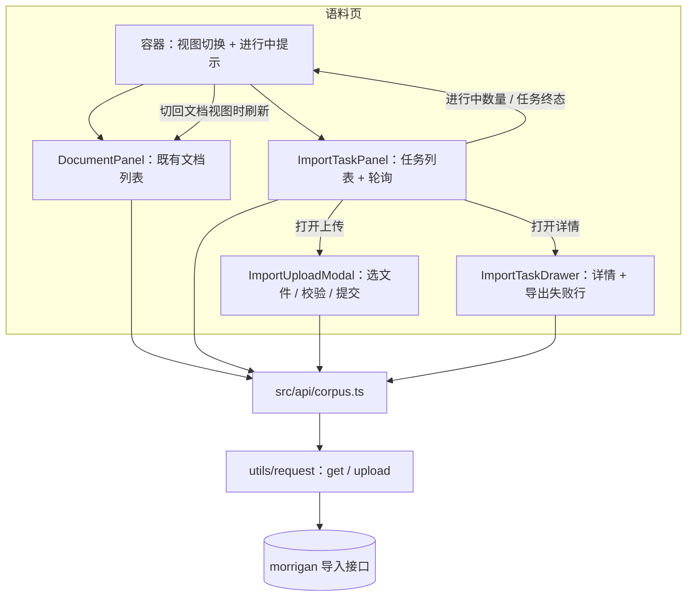

# feat: CSV 导入任务面板

**Target repos:** 主体落在本仓库（Calisyn 前端）；U1 落在相邻仓库 morrigan（`../morrigan`）。除 U1 外，所有路径均相对 Calisyn 根目录。

## Summary

把语料页现在禁用的导入入口换成一条能走通的 keeper 自助链路：请求层补 multipart 上传能力，corpus API 层接入 morrigan 的导入任务三接口，导入相关的校验/状态/导出逻辑抽成可单测的纯函数，语料页拆成「文档 / 导入任务」双视图并补上传弹窗与详情抽屉。落地顺序为「morrigan 明细类型 → 请求与接口层 → 纯逻辑 → 组件 → 页面接线 → 文案」。

---

## Problem Frame

语料维护此前只能靠命令行或直接改库，Calisyn 语料页只留了一个禁用按钮（见 origin 的 Problem Frame）。morrigan 已把导入做成异步任务队列并把状态、计数、明细持久化，本计划要解决的是前端如何消费这套能力——尤其是 token 之外的两个前端缺口：现有请求封装只会发 JSON（发不出 multipart），以及任务耗时由 embedding 逐行决定，界面必须能在用户离开当前视图后仍然反馈进度。

---

## Requirements

**入口与权限**

- R1. 语料管理页提供「文档 / 导入任务」视图切换，不改变路由与既有 keeper 前提。
- R2. 导入任务视图提供「上传 CSV」入口，替代禁用占位按钮。
- R3. 上传、任务列表与任务详情仅 keeper 可用，403/401 给出既有口径的明确提示。

**上传与前置校验**

- R4. 选择单个 CSV 后，弹窗展示文件名与大小，可提交或取消；提交成功即创建任务并关闭。
- R5. 提交前预校验：CSV 类型、≤ 10 MiB、UTF-8、表头 `title,heading,content`；不合格不创建任务。
- R6. 上传入口内提供格式说明与「下载模板」（仅表头）。
- R7. 上传失败保留已选文件与弹窗内容，可直接重试并展示服务端原因。

**进度与可见性**

- R8. 任务行展示文件名、状态、总行数、成功/失败/跳过计数、创建与完成时间。
- R9. 处理中只展示状态与开始时间，不展示行级进度或百分比。
- R10. 仅当存在排队中/处理中任务时才周期性刷新；无活跃任务即停止。
- R11. 存在进行中任务时，停留在文档视图也给出常驻提示与进行中数量。
- R12. 任务进入终态时给出一次完成摘要，同一任务不重复提示。

**历史与详情**

- R13. 任务列表按创建倒序分页，支持状态筛选，覆盖空/加载中/加载失败（可重试）。
- R14. 任务详情展示文件名、状态、计数、创建/开始/完成时间，以及逐行失败与跳过明细。
- R15. 明细触及后端上限时标注「仅展示前 N 条」，不暗示全量。
- R16. 任务记录只读，不提供取消/重试/删除/编辑入口。

**失败明细出口**

- R17. 详情提供「下载失败行 CSV」：含表头、仅含失败行、可直接再次上传。

**核对、呈现一致性与文案**

- R18. 任务进入终态后，切回文档视图时列表自动重新拉取并回到第一页。
- R19. 新增文案接入多语言体系，与既有语料文案口径一致。
- R20. 列表总数「共 N 条」位于表格左下方、与分页同一行的左侧，两个视图位置一致。

**Origin actors:** A1 高级权限用户（keeper）、A2 后台导入 worker
**Origin flows:** F1 上传导入（R2, R4-R8）、F2 进度跟踪（R9-R12）、F3 回看与排查（R13-R17）、F4 导入后核对文档（R18）
**Origin acceptance examples:** AE1（R2, R4, R7）、AE2（R5）、AE3（R9-R12）、AE4（R13-R15）、AE5（R17）、AE6（R3）、AE7（R18）、AE8（R20）

---

## Scope Boundaries

沿用 origin 的边界（见 origin 的 Scope Boundaries）：不改动 morrigan 的队列行为与并发模型，不做取消/重试/删除任务、完成通知、非 CSV 格式、多文件上传、文档来源标注、任务全局搜索。

本计划新增的技术边界：

- 不重构语料页既有文档能力（语义搜索、排序、抽屉编辑、删除）；抽取文档面板时只搬移，不改行为。
- 不引入第三方上传/CSV 组件；上传弹窗沿用仓库既有的隐藏 file input + FileReader 写法。
- 不追踪任务在页面上的历史点击态；任务详情只在打开时拉取。

### Deferred to Follow-Up Work

- 若后端后续提供推送或处理中进度，前端把轮询换成推送并去掉「不显示行级进度」的约束：后续迭代。
- 任务历史自动清理策略与失败行批量重提：morrigan 侧后续迭代，前端不加对应入口。

---

## Context & Research

### morrigan 导入接口契约（已核实源码）

- 路由挂载在 `settings.Current.APIPrefix`（本地 `/api/m`），前端相对路径经 axios baseURL 拼接，与既有 `/corpus/documents` 用法一致。
- `POST /corpus/imports`：multipart，字段名 `file`；上限 10 MiB（超限 413）、必须 UTF-8（否则 400）、剥离 BOM 后校验表头（`pkg/services/stores/corpus_x.go` 的 `ValidHead`：至少 3 列，前 3 列小写等于 `title,heading,content`，允许额外列）；成功返回任务视图。
- `GET /corpus/imports`：查询参数 `status`（`pending|processing|succeeded|failed`，小写字符串）、`filename`（前缀匹配）、`page`、`limit`（默认 20）、`sort`（默认 `-created`）；响应 `{ status, result: { data, total } }`，**不含** CSV 原文与明细。
- `GET /corpus/imports/{id}`：返回任务视图，含 `errors[]`（`line`、`title`、`reason`）。
- 任务视图字段：`id`、`filename`、`status`、`total`、`success`、`failed`、`skipped`、`errors?`、`createdAt`、`updatedAt?`、`startedAt?`、`finishedAt?`。
- 计数与明细只在任务结束时写回（`finishImportTask`），处理中三者均为 0——这是 R9 的事实依据。
- 明细上限：每任务最多 500 条、reason 截断 200 字符；`errors` 同时承载失败与跳过条目，跳过条目的 reason 是硬编码中文文案 `重复文档: title+heading 已存在，跳过`，**当前没有类型字段**——这是 U1 要补的洞。
- 权限：三个端点均需 keeper，403/401 由 `authPerm` 返回，响应体为 `{ status, message }`。

### Relevant Code and Patterns

- 请求封装：`src/utils/request/index.ts` 的 `http()`/`successHandler`/`failHandler`，已有 `get/post/put/patch/del`；`failHandler` 已保留服务端 message 与 status。`src/utils/request/axios.ts` 注入 token 并设置 baseURL。
- 语料 API 层：`src/api/corpus.ts`（`CorpusEnvelope` 信封类型与函数式导出）、`src/api/corpus.test.ts`（`vi.mock('@/utils/request')` 断言 URL 与参数）。
- 语料页：`src/views/corpus/index.vue`（搜索行内含「共 N 条」、`NDataTable` + 远程分页、`loadToken` 防止旧响应覆盖、`reloadAfterMutation` 回退页）；`src/views/corpus/components/DocumentDrawer.vue`（抽屉表单与二次确认删除）；`src/views/corpus/utils.ts` + `utils.test.ts`（纯函数 + i18n key 映射的测试范式）。
- 上传先例：`src/components/common/Setting/General.vue` 用隐藏 `<input type="file">` + `FileReader` + 程序化 `click()` 读取本地文件。
- UI 与布局：naive-ui（`NDataTable/NModal/NInput/NButton/NSelect/NPagination/NTabs/NDrawer/NText`）、`useMessage`/`useDialog`、`useBasicLayout` 处理移动端。
- i18n：`src/locales/{zh-CN,en-US,zh-TW,es-ES,ko-KR,ru-RU,vi-VN}.ts`，`corpus` 文案块已存在，新增键需同步 7 个文件。
- 权限：`src/router/permission.ts` 的 `ensureCorpusAccess` 已保证语料页仅 keeper 可达，本计划不新增权限逻辑。
- 测试基建：vitest + jsdom（`vitest.config.ts`），仓库未安装 `@vue/test-utils`，因此单测落在纯函数与 API 层，组件行为靠手动走查。

### Institutional Learnings

- `docs/solutions/` 不存在；`docs/todos/` 现有条目（001-009）集中在聊天流、SSRF、依赖与文档整理，与本功能无直接冲突。
- 既有计划 `docs/plans/2026-08-24-001-feat-corpus-document-management-panel-plan.md` 记录了语料页的关键既有约束（`Layout.vue` 强制 replace、请求封装缺 DELETE、`match` 语义搜索），本计划沿用其结论。

### External References

- 无需外部调研：上传、列表、详情、轮询都属于仓库内已有先例的技术层（axios 封装、naive-ui 表格与抽屉、隐藏 file input），且接口契约已从 morrigan 源码逐条核实。

---

## Key Technical Decisions

- **请求层新增独立的 `upload()`，而不是让 `post()` 承载 multipart**：`http()` 会用 `Object.assign` 归一化 body，FormData 走这条路径属于侥幸可用；独立分支让边界明确，且不改变既有五个方法的语义。
- **不手动设置 `Content-Type`**：multipart 边界必须由浏览器/axios 生成，手写 `multipart/form-data` 会导致服务端解析失败。
- **未部署 U1 时按保守策略降级**：`errors[].kind` 可选；缺少 kind 时先按 reason 前缀与 `failed`/`skipped` 计数交叉校验，仍无法判定的条目归入「未分类」并在导出中保留——多导一行重复行是无害的，漏掉失败行才有害。
- **导入逻辑抽成纯函数模块**（`src/views/corpus/import.ts`）：校验、状态映射、明细分类、CSV 生成都可单测，组件只做编排。这是本仓库既有的 `views/corpus/utils.ts` 范式。
- **视图切换用本地状态并让两个面板都保持挂载（`v-show`）**：语料页是单路由 keeper 页面，加 query 参数会让权限守卫与返回逻辑复杂化；保留挂载则轮询与已加载数据在切换视图时都不丢，R11 的跨视图提示也有了数据源。
- **轮询由导入任务面板自持**：只有列表中存在 `pending`/`processing` 时才启动定时刷新，全部进入终态即停，组件卸载清除定时器；容器不承担两套数据生命周期。
- **进行中与完成状态用事件上报**：面板向容器上报「进行中数量」与「最近完成的终态任务」，容器据此渲染跨视图提示，并在切回文档视图时触发刷新（R11、R18）。
- **处理中显示占位而不是 0**：后端结束时才写回计数，`processing` 状态下计数渲染为 `—`，避免用户误读为「0 行成功」。
- **完成摘要按任务 ID + 终态去重**：轮询会多次返回同一终态任务，去重集合保证 R12 只提示一次。
- **上传预校验与后端同口径**：大小、UTF-8、表头判定（去 BOM、前 3 列大小写不敏感、允许额外列）对齐 `ValidHead`，同时保留服务端 400/413 的兜底提示。
- **文档面板抽取只是搬移**：`index.vue` 里文档列表相关的状态与模板整体搬到 `DocumentPanel.vue`，不改搜索/排序/分页/抽屉/删除行为，仅顺带把总数移到分页行左侧（R20）。

---

## Open Questions

### Resolved During Planning

- 导入接口契约（路径、multipart 字段名、状态取值、计数写回时机、明细上限、表头校验口径）：已从 morrigan 源码核实。
- 前端上传能力缺口：现有封装无 multipart 与上传进度，由 U2 补齐。
- 明细中失败与跳过的区分方式：确认由 morrigan 补类型字段（U1），前端保留降级路径。
- 计数在 `processing` 期间为 0 的事实：塑造了 R9 的界面约束，不展示行级进度。

### Deferred to Implementation

- 轮询间隔的具体取值（暂定 3 秒）与窗口隐藏时是否暂停；实施期按体感与请求噪音调整。
- 上传进度条是否必要：先接 `onUploadProgress`，10 MiB 内本地网络通常瞬时完成，界面按需展示或只显示提交中状态。
- 明细在 500 条时的渲染方式（普通滚动还是虚拟列表）。
- 视图切换是否保留上一视图的滚动位置与筛选状态。
- 容器与面板之间的具体 props/事件命名。

---

## Alternative Approaches Considered

- **明细分类继续依赖 reason 文案**：不新增后端字段、改动最小，但把给人看的文案当成接口契约，改文案或做多语言时会静默失效。放弃。
- **导入任务做成独立路由**：任务列表可分享、可直达，但会让「上传后核对文档」变成来回跳，违背 origin 的产品判断。放弃。
- **用 naive-ui `NUpload` 承载上传**：省掉文件选择与状态管理，但要接管它的请求链路才能复用统一错误语义，而仓库已有隐藏 file input + FileReader 的先例。放弃。
- **轮询上移到语料页容器**：容器成为唯一数据源，但两个视图各自的数据生命周期会缠在一起，且容器需要感知任务细节。放弃。

---

## High-Level Technical Design

> *This illustrates the intended approach and is directional guidance for review, not implementation specification. The implementing agent should treat it as context, not code to reproduce.*



轮询生命周期的形状（方向性说明，不是实现规格）：

```text
任务面板挂载 → 拉取任务列表
  列表含 pending/processing ?
    是 → 每 N 秒重新拉取；期间持续上报进行中数量
       任一任务首次进入终态 → 上报「最近完成」并给出一次完成摘要
    否 → 停止定时刷新
组件卸载 → 清除定时器
```

---

## Implementation Units

### U1. morrigan：导入明细条目增加类型标识

**Goal:** 让导入明细条目自带「失败 / 跳过」类型，使前端能可靠区分两者并只导出失败行。

**Requirements:** R14, R17（origin 的 Dependencies 也记录了这条依赖）

**Dependencies:** None

**Files:**
- Modify: `../morrigan/docs/corpus.yaml`（`ImportFailure` 增加 `Kind` 字段与 `ImportFailureKind` 枚举）
- Generated: `../morrigan/pkg/models/corpus/corpus_gen.go`、`../morrigan/pkg/services/stores/corpus_gen.go`、`../morrigan/docs/swagger.json`、`../morrigan/docs/swagger.yaml`（由 `make codegen` 产出，勿手改）
- Modify: `../morrigan/pkg/services/stores/corpus_x.go`（追加明细时写入类型）
- Test: `../morrigan/pkg/services/stores/import_task_test.go`、`../morrigan/pkg/models/corpus/import_task_test.go`

**Approach:**
- 枚举沿用 `ImportTaskStatus` 的形态（int8 + start、textMarshaler/textUnmarshaler），JSON 输出 `failed` / `skipped`，与前端类型一致。
- 明细以 JSONB 存储，类型经文本序列化写入即可，不需要数据库迁移；历史行缺省值表示「未分类」，前端对此有降级路径。
- 写入点集中在 `ProcessImportTask` 的三处：无效行与导入异常 → `failed`；`title+heading` 已存在 → `skipped`。既有 reason 文案保持不变（前端降级路径与用户可读性都依赖它）。
- API 视图直接嵌入 `corpus.ImportFailure`，handler 无需改动；确认 swagger 产物已重新生成。

**Patterns to follow:**
- 枚举定义与生成：`docs/corpus.yaml` 的 `ImportTaskStatus`、`pkg/models/corpus/corpus_gen.go`
- 明细写入：`pkg/services/stores/corpus_x.go` 的 `appendImportError` 调用点

**Test scenarios:**
- Happy path（集成）：导入含 1 行重复 + 1 行缺字段的 CSV，任务明细中跳过条目 kind 为 skipped、无效行为 failed，计数仍为 1 skipped / 1 failed。
- Edge case（模型）：枚举 `Decode` 接受 `failed`/`Failed`/`2` 等形式，`String`/`MarshalText` 往返一致，零值不 panic。
- Regression：既有 reason 文案与计数语义不因新增字段而改变。

**Verification:**
- `make codegen` 后仓库编译与 vet 通过，生成文件含新枚举与字段。
- 集成测试断言两类明细的 kind 取值正确。
- 本地实例的详情响应中出现 kind 字段，列表接口仍不返回明细。

---

### U2. 请求层 multipart 上传与导入任务 API 层

**Goal:** 让前端能提交 multipart 文件并读写导入任务，同时不改变既有请求语义。

**Requirements:** R4, R7, R8, R13, R14

**Dependencies:** None（`errors[].kind` 声明为可选，未部署 U1 也能联调）

**Files:**
- Modify: `src/utils/request/index.ts`
- Modify: `src/utils/request/index.test.ts`
- Modify: `src/api/corpus.ts`
- Modify: `src/api/corpus.test.ts`

**Approach:**
- 请求层新增 `upload()`：以 POST 直接提交 `FormData`，跳过 `http()` 的 body 归一化；复用同一套成功/失败处理，保留服务端 message 与 HTTP status；`HttpOption` 增加 `onUploadProgress` 并透传给 axios，不设置 `Content-Type`。
- API 层新增类型：任务（`id`/`filename`/`status`/`total`/`success`/`failed`/`skipped`/`errors?`/时间字段）、明细条目（`line`/`title`/`reason`/`kind?`）、查询参数（`page`/`limit`/`status`/`sort`）。
- API 层新增三个函数：上传创建任务（`file` 字段）、查询任务列表、查询任务详情；沿用既有的响应信封类型与 `as unknown as` 类型对齐写法。

**Patterns to follow:**
- 请求封装：`src/utils/request/index.ts` 的 `del()` 与 `failHandler`
- API 层：`src/api/corpus.ts` 现有三个函数的签名与注释风格；`src/api/corpus.test.ts` 的 mock 断言方式

**Test scenarios:**
- Happy path：`upload()` 把原样的 FormData 实例交给 axios，且未手工注入 Content-Type。
- Happy path：`onUploadProgress` 透传到 axios 配置。
- Error path：服务端 413 返回 message 时，reject 的 Error 保留该 message 与 status。
- Regression：`get/post/put/patch/del` 既有断言全部不变。
- Happy path（API）：上传函数的 FormData 中字段名为 `file` 且值为所选文件；列表函数的查询参数原样透传；详情函数 URL 拼接正确。
- Edge case（API）：列表响应不含 `errors` 时取值安全，不抛错。

**Verification:**
- 新增单测全部通过，`pnpm type-check` 无新错误。
- 既有请求层与语料 API 测试保持绿色，说明共享模块未被破坏。

---

### U3. 导入相关纯逻辑工具

**Goal:** 把上传前校验、状态映射、明细分类与 CSV 生成沉淀为可单测的纯函数。

**Requirements:** R5, R9, R12, R15, R17

**Dependencies:** U2（类型定义）

**Files:**
- Create: `src/views/corpus/import.ts`
- Create: `src/views/corpus/import.test.ts`

**Approach:**
- 常量：上传大小上限 10 MiB、必需表头 `title,heading,content`。
- 校验：接收文件名、大小与文本内容，返回 i18n key 或 null；表头判定对齐后端 `ValidHead`（去 BOM、按 CSV 规则解析首行、前 3 列大小写不敏感、允许额外列）。
- 状态：状态到 i18n key 的映射、是否存在活跃任务（`pending`/`processing`）、终态判定。
- 明细分类：优先按 `kind` 分区；`kind` 缺失时按 reason 前缀加 `failed`/`skipped` 计数交叉校验降级；仍无法判定的条目归入「未分类」并在导出中保留。
- 截断判定：明细条目数少于 `failed + skipped` 计数时判定为被后端截断。
- 导出：失败行 CSV 首行为表头，字段按 RFC4180 转义（含分隔符、引号、换行时加引号并双写引号）；模板函数只产出表头行。
- 完成摘要：由计数拼出「成功 / 失败 / 跳过」摘要数据（文案在组件层取 i18n）。

**Patterns to follow:**
- `src/views/corpus/utils.ts` 的纯函数 + i18n key 返回约定；`src/views/corpus/utils.test.ts` 的用例组织方式

**Test scenarios:**
- Happy path：合法文件名/大小/表头返回 null；带计数的明细能正确分区失败与跳过。
- Edge case：表头含 BOM、CRLF、大小写混合、额外第 4 列时视为通过；缺列或顺序不符时返回对应错误 key。
- Edge case：`kind` 缺失且计数无法校验时，不确定条目进入导出（不丢行）。
- Error path：超过大小上限、非 `.csv` 扩展名分别返回各自的错误 key。
- Happy path：导出 CSV 的数据行数等于失败行数，含逗号/引号/换行的标题被正确转义。
- Edge case：明细长度小于计数和时截断判定为真；`failed` 与 `skipped` 均为 0 时不产生导出内容。

**Verification:**
- 纯函数单测覆盖上述场景且全绿，无需渲染组件。

---

### U4. 任务详情抽屉与失败行导出

**Goal:** 展示单个任务的计数、时间与逐行明细，并支持把失败行导回本地。

**Requirements:** R14, R15, R17

**Dependencies:** U2, U3

**Files:**
- Create: `src/views/corpus/components/ImportTaskDrawer.vue`

**Approach:**
- 打开时按任务 ID 拉取详情（列表不返回明细），加载中与加载失败都有明确状态，失败可重试。
- 头部展示文件名、状态、计数与创建/开始/完成时间；未完成的字段显示占位。
- 明细以表格呈现行号、标题、原因与类型标识，失败与跳过视觉上可区分；空明细时给出明确空态。
- 截断时按 U3 的判定标注「仅展示前 N 条」。
- 导出按钮只在存在可导出条目时可用，导出内容由 U3 生成，通过浏览器下载为 CSV 文件；不提供重试、取消、删除入口（R16）。
- 关闭抽屉时重置本地状态，避免下一次打开闪现上一个任务的数据。

**Patterns to follow:**
- `src/views/corpus/components/DocumentDrawer.vue` 的抽屉结构、加载与错误处理、`useMessage` 用法
- 错误文案映射：`src/views/corpus/utils.ts` 的 `corpusErrorKey`

**Test scenarios:**
- 手动：打开已完成任务看到计数、时间与明细；打开失败任务看到失败条目；明细为空时显示空态。
- 手动：明细被截断的任务出现「仅展示前 N 条」标注。
- 手动：点击导出得到可直接再次上传的 CSV，内容仅含失败行（不含跳过的重复行）。
- 手动：详情加载失败（模拟 503）时可重试，关闭再打开不残留上一个任务的数据。
- Test expectation: none — 组件级行为依赖 naive-ui 抽屉与消息提示，仓库未安装 `@vue/test-utils`，由 U3 的单测覆盖分类与导出逻辑，组件走查在 Verification 的端到端清单中执行。

**Verification:**
- 抽屉对已完成/已失败/明细为空/明细被截断四类任务都呈现正确。
- 导出的 CSV 能被上传入口重新接受，形成修正闭环。

---

### U5. 导入任务面板

**Goal:** 提供任务列表、状态筛选、分页、轮询刷新与完成摘要，并作为上传与详情的入口。

**Requirements:** R8, R9, R10, R12, R13, R16

**Dependencies:** U2, U3, U4

**Files:**
- Create: `src/views/corpus/components/ImportTaskPanel.vue`

**Approach:**
- 列表列：文件名、状态、计数（总/成功/失败/跳过）、创建时间、完成时间；`processing` 状态下计数显示占位而非 0（R9）。
- 筛选与分页：状态筛选（全部/排队中/处理中/已完成/已失败）与分页都走服务端参数，默认按创建倒序；空态、加载中、加载失败（可重试）都有明确呈现。
- 轮询：仅当列表存在 `pending`/`processing` 时按固定间隔重新拉取；全部进入终态后停止；组件卸载清除定时器。
- 并发响应保护：筛选、翻页与轮询可能同时在飞，沿用文档面板的请求序号写法，只接受最后一次发起的响应，避免旧数据覆盖新筛选结果。
- 完成摘要：任务首次进入终态时提示一次，按任务 ID 去重，避免轮询重复提示（R12）。
- 对外通信：持续向容器上报进行中数量，并在有任务进入终态时上报「最近完成」，供容器的跨视图提示与文档视图刷新使用。
- 工具栏提供「上传 CSV」按钮（替代禁用占位），点击打开上传弹窗（U6）；行点击打开详情抽屉（U4）。
- 无取消/重试/删除入口（R16）。

**Patterns to follow:**
- `src/views/corpus/index.vue` 的 `loadToken` 旧响应丢弃写法、远程分页/排序受控状态、错误与重试呈现
- `src/api/corpus.ts` 的列表函数与响应信封取值

**Test scenarios:**
- 手动：任务运行时列表按间隔自动刷新；全部完成后停止刷新（观察网络面板）。
- 手动：处理中的任务行不显示百分比、计数显示占位。
- 手动：按状态筛选与翻页触发服务端请求，空结果与加载失败（模拟 503）都有明确呈现且可重试。
- 手动：同一任务完成只提示一次完成摘要，且摘要计数与任务行一致。
- 手动：列表为空时不启动轮询，页面停留不产生周期性请求。
- 手动：在轮询进行中切换状态筛选或翻页，最终展示的是最新筛选结果，不被更早返回的响应覆盖。
- 手动：任务列表加载返回 403/401 时展示既有的权限/登录过期文案（复用 `corpusErrorKey`），不静默失败。
- Test expectation: none — 轮询与列表交互是组件级行为，仓库未安装 `@vue/test-utils`；依赖 U3 覆盖状态判定与摘要逻辑，组件行为在端到端走查中验证。

**Verification:**
- 任务从排队到终态的整个过程在页面上可见，且不依赖用户停留位置。
- 无活跃任务时页面不再产生周期性请求。

---

### U6. 上传弹窗

**Goal:** 让 keeper 选中 CSV、通过预校验并提交创建任务，失败时可原地重试。

**Requirements:** R4, R5, R6, R7

**Dependencies:** U2, U3

**Files:**
- Create: `src/views/corpus/components/ImportUploadModal.vue`

**Approach:**
- 沿用隐藏 `<input type="file">` + 程序化 `click()` 的既有写法（限制 `.csv`），选中后展示文件名与大小。
- 读取文件文本后按 U3 的校验函数判断，不合格就地显示原因且不提交；合格才允许提交。
- 说明区展示必需表头、字符编码、大小上限与「重复行会被跳过而不覆盖已有文档」的语义，并提供「下载模板」（表头行）。
- 提交走 U3/U2 的上传链路，提交中禁用重复点击；成功后关闭弹窗并通知面板刷新列表，失败时保留已选文件与弹窗内容并展示服务端原因（R7）。
- 用户取消或关闭弹窗时清空已选文件状态。

**Patterns to follow:**
- 隐藏 file input + FileReader：`src/components/common/Setting/General.vue`
- 模态与表单：naive-ui `NModal` + `NInput`，文案统一走 `t()`

**Test scenarios:**
- 手动：选择合法 CSV 后显示文件名与大小，提交后弹窗关闭、任务出现在列表顶部且状态为排队中。
- 手动：选择超过 10 MiB 的文件或表头不符的文件时，弹窗就地提示原因且不发请求。
- 手动：提交时服务端返回 503（模拟）后弹窗保留已选文件并提供重试。
- 手动：提交时服务端返回 403 或 401 时，弹窗就地展示权限不足 / 登录过期文案，且不丢失已选文件。
- 手动：点「下载模板」得到仅含表头行的文件，用该文件（补数据行后）可再次导入成功。
- Test expectation: none — 文件选择与弹窗状态是组件级行为；校验规则由 U3 单测覆盖。

**Verification:**
- 一次成功上传的完整路径可用，且不合法文件在提交前被挡下、错误原因可读。

---

### U7. 语料页容器：文档面板抽取、视图切换与跨视图联动

**Goal:** 把语料页改成「文档 / 导入任务」双视图容器，并在文档视图保留既有能力的同时完成总数位置迁移与导入完成后的刷新。

**Requirements:** R1, R2, R10, R11, R18, R20（并保持既有文档能力的 R5-R11 行为不变）

**Dependencies:** U4, U5, U6

**Files:**
- Create: `src/views/corpus/components/DocumentPanel.vue`
- Modify: `src/views/corpus/index.vue`

**Approach:**
- 把 `index.vue` 中与文档列表相关的状态与模板整体搬进 `DocumentPanel.vue`（搜索、排序、分页、抽屉、删除、错误与重试），保持行为与 API 调用不变；`index.vue` 只保留页面外壳、标题、返回聊天与视图切换。
- 抽取时顺带完成 R20：总数从搜索行移到分页行左侧，与分页同排（左总数、右分页控件）。
- 两个面板都保持挂载、用显示状态切换，使任务轮询与已加载数据在视图切换时不中断。
- 容器接收导入面板上报的进行中数量，渲染跨视图常驻提示（R11）；接收「最近完成」信号，在切回文档视图时触发文档列表刷新并回到第一页（R18）。
- 文档面板通过 props 接收「刷新触发器」并暴露刷新入口；导入完成后不强制切换视图（用户可能正想看某个文档）。

**Patterns to follow:**
- 既有 `index.vue` 的布局类名与 `NButton`/`SvgIcon` 用法、`handleBackToChat` 逻辑
- 面板间通信沿用仓库既有 props/emit 风格（如 `DocumentDrawer`）

**Test scenarios:**
- 手动（回归）：抽取后文档列表的语义搜索、回车提交、排序、分页、抽屉编辑保存、删除与删除后回退页全部与现状一致。
- 手动（R20/AE8）：文档视图的「共 N 条」出现在分页行左侧、搜索行不再显示；导入任务视图遵循同一位置约定。
- 手动（R11/AE3）：有任务运行时切到文档视图仍看到进行中提示与数量；任务完成后提示消失。
- 手动（R18/AE7）：文档视图停在第 2 页时任务完成，切回文档视图后列表回到第一页并包含新导入的文档。
- 手动：非 keeper 状态下的既有行为不变（页面不可达）。
- Test expectation: none — 该单元是页面结构与跨组件联动，组件级测试在本仓库缺少测试工具链；回归由既有 utils/api 单测加手动走查覆盖。

**Verification:**
- 语料页双视图切换正常，既有文档能力零回归，R11/R18/R20 的行为在浏览器中可观察。

---

### U8. 多语言文案

**Goal:** 导入任务相关文案接入全部语言，并与既有语料文案口径一致。

**Requirements:** R19

**Dependencies:** U5, U6, U7

**Files:**
- Modify: `src/locales/zh-CN.ts`
- Modify: `src/locales/en-US.ts`
- Modify: `src/locales/zh-TW.ts`
- Modify: `src/locales/es-ES.ts`
- Modify: `src/locales/ko-KR.ts`
- Modify: `src/locales/ru-RU.ts`
- Modify: `src/locales/vi-VN.ts`

**Approach:**
- 在既有 `corpus` 文案块下扩展导入相关键：视图切换标签、上传入口与弹窗（格式说明、模板下载、预校验错误）、任务状态与计数占位、任务列表列名与筛选、进行中提示、完成摘要、详情字段与明细列、导出按钮与提示、截断说明。
- 替换现有 `importDisabled` 文案的用途：占位说明不再使用，改为上传弹窗内的格式说明键，避免遗留误导性文案。
- 计数与摘要使用插值参数，保持与既有 `total: '共 {total} 条'` 同样的写法。

**Patterns to follow:**
- `src/locales/zh-CN.ts` 既有 `corpus` 块的键命名与插值写法

**Test scenarios:**
- 手动：zh-CN 与 en-US 下走查上传弹窗、任务列表、详情抽屉与导出提示，文案无缺失键、无英文回退残留。
- Test expectation: none — 纯文案变更，无行为分支。

**Verification:**
- 7 个语言文件的 `corpus` 键集合一致，页面无 missing key 警告；`pnpm type-check` 与 lint 通过。

---

## System-Wide Impact

- **Interaction graph:** `src/views/corpus/index.vue` 从单视图页变成容器，向下多出文档面板、导入任务面板、上传弹窗与任务详情抽屉；请求层新增 `upload` 导出；corpus API 层新增三个函数；morrigan 任务视图新增 kind 字段。
- **Error propagation:** 请求层 `failHandler` 语义保持不变（服务端 message + status），新增的 400/413 上传错误按同一路径抵达 UI；403/401 继续经 `corpusErrorKey` 映射既有文案；轮询失败不清空已加载任务，只呈现可重试的错误状态。
- **State lifecycle risks:** 轮询定时器必须在无活跃任务与组件卸载时清除；完成提示去重集合随会话增长但任务量有限；文档列表在导入完成后回到第一页会丢弃用户当前分页位置（需求已接受）。
- **API surface parity:** `utils/request` 是共享模块，新方法是纯增量；morrigan 的明细类型字段是向后兼容的新增字段，老前端与历史数据不受影响；既有语料文档 CRUD、语义搜索 `match` 参数、keeper 守卫均不变。
- **Integration coverage:** 「上传 → 排队 → 处理 → 终态 → 提示 → 文档列表刷新 → 导出失败行再上传」这条链路依赖真实 morrigan 实例，单测无法覆盖，需按 origin 的 AE1-AE8 手动走查。
- **Unchanged invariants:** morrigan 的队列行为、并发模型与计数语义；语料页既有文档能力的交互契约；7 个语言文件既有键；`Layout.vue` 与路由守卫对语料页的既有处理。

---

## Risks & Dependencies

| Risk | Mitigation |
| --- | --- |
| morrigan 新字段未部署时前端分类退化 | `kind` 声明为可选；按 reason 前缀 + 计数交叉校验降级；无法判定的条目在导出中保留，保证不漏失败行 |
| 抽取 `DocumentPanel` 引入既有文档功能回归 | 只搬移不改逻辑；既有 utils/api 单测保持绿色；按 origin 的既有验收点手动走查搜索/排序/分页/编辑/删除 |
| 上传大小与格式的前端判定与后端不一致 | 校验口径对齐 `ValidHead`（去 BOM、前 3 列、允许额外列）与 10 MiB 上限；服务端 400/413 作为兜底仍会展示 |
| 轮询产生无谓请求或页面隐藏时噪音 | 仅在有活跃任务时轮询、终态即停、卸载即清；间隔与窗口隐藏策略在实施期确认 |
| 明细被后端截断导致 keeper 误以为全部展示 | 用计数与明细长度差判定截断并显式标注 |
| 导入完成后刷新文档列表重置用户分页/筛选 | 需求已接受；实现时保留关键词与排序，仅回到第一页 |
| morrigan 与前端发布顺序耦合 | U1 先发布且向后兼容，前端在缺字段时仍可用（降级路径） |

**Dependencies / Prerequisites:**

- 部署的 morrigan 版本包含导入三接口（含本次新增的明细类型字段）且可经既有 API 前缀访问。
- 单实例部署：任务串行执行，进程重启会恢复未完成任务。
- 联调需要一个 keeper 账号与真实或等价规模的 CSV 数据。

---

## Phased Delivery

### Phase 1

- U1：morrigan 明细类型字段，可独立发布并向后兼容。

### Phase 2

- U2、U3：请求层与纯逻辑，无 UI 风险，可先行合入并用单测锁定契约。

### Phase 3

- U4、U5、U6、U7、U8：任务详情、任务面板、上传弹窗、页面接线与文案，按此顺序落地便于每步单独走查。

---

## Sources & References

- **Origin document:** [docs/brainstorms/2026-09-13-csv-import-task-panel-requirements.md](../brainstorms/2026-09-13-csv-import-task-panel-requirements.md)
- morrigan 参考变更：commit `81fbb5e`（async CSV document import）
- morrigan 契约源码：`../morrigan/pkg/web/api/handle_corpus_import.go`、`../morrigan/pkg/services/stores/corpus_x.go`、`../morrigan/pkg/services/stores/import_worker.go`、`../morrigan/docs/corpus.yaml`
- 相关既有计划：`docs/plans/2026-08-24-001-feat-corpus-document-management-panel-plan.md`
- 相关代码：`src/utils/request/index.ts`、`src/api/corpus.ts`、`src/views/corpus/index.vue`、`src/views/corpus/utils.ts`、`src/views/corpus/components/DocumentDrawer.vue`、`src/components/common/Setting/General.vue`、`src/locales/zh-CN.ts`
