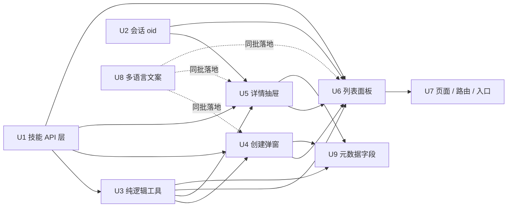

# 技能浏览与管理面板

**目标仓库：** 改动全部落在 Calisyn 前端，文中路径相对本仓库根目录。`../morrigan`（后端）与 `../andvari`（查询/存储库）只作为只读契约来源，本计划不改动它们。

## Summary

把 morrigan v0.9.0 已经上线、前端却完全没有入口的技能能力接出来：新增技能接口层，把校验、frontmatter 拼装与解析、差分提交、频道呈现、归属判定沉淀为可单测的纯函数，再加「列表 + 创建弹窗 + 详情抽屉」三个组件、一条对所有登录用户可见的侧边栏入口，以及七种语言的文案。落地顺序为：接口层与身份字段 → 纯逻辑 → 创建弹窗 → 详情抽屉 → 列表面板（组装前两者）→ 页面外壳、路由与入口；多语言文案随组件同批补齐，不单独排在最后。

**2026-09-14 追加（U9）：** morrigan `89f1631` 给技能补了七个 frontmatter 元数据字段（`version` / `author` / `license` / `platform` / `category` / `homepage` / `relatedSkills`），全部可空、由 SKILL.md 正文派生入库。本计划追加一轮：创建弹窗与编辑抽屉在现有字段**之后**追加这七个可选字段，由表单拼进 frontmatter 的对应位置，并让抽屉只读态展示非空元数据。R19 之后的 R20–R23 描述这一轮，落地单元为 U9。

---

## Problem Frame

morrigan v0.9.0（2026-09-10）已交付技能的完整 REST：用户级接口按「频道投放 ∪ 自己创建」判定可见性，另有 keeper 专属的全量管理接口。但 Calisyn 侧 `src/` 下不存在任何技能相关代码，侧边栏也没有入口；同时技能表是空的，而 morrigan 的 CLI 只有文档导入/导出与 swagger 能力导入，没有技能命令——要建一个技能只能手写 curl 打接口或直接改库。两层后果叠加，技能能力停留在「后端已支持、产品未交付」。

接口契约本身清晰（本计划的契约小节逐条核实过源码），所以这份计划真正要定的是三处前端规则：谁算 owner、正文 frontmatter 怎么拼才不把「格式填错」变成主要失败模式、以及空表首屏怎么引导创建。

(see origin: docs/brainstorms/2026-09-13-skill-management-requirements.md)

---

## Requirements

来源：`docs/brainstorms/2026-09-13-skill-management-requirements.md`。下表是 origin 的 R1–R19 与落地单元的对应关系；R20–R23 是本计划 2026-09-14 追加的一轮（对齐 morrigan `89f1631`），落地单元 U9。

| ID | 需求 | 落地单元 |
| --- | --- | --- |
| R1 | 独立技能页面路由 + 侧边栏底部图标入口，对所有登录用户显示 | U7 |
| R2 | 页面不做 keeper 分支：可见集恒为「频道投放 ∪ 自己创建」 | U7 |
| R3 | 编辑/删除入口仅对 owner 为当前登录用户的技能显示 | U2, U5, U6 |
| R4 | 401/403 与请求失败给出明确提示，不静默失败、不空白页 | U1, U6 |
| R5 | 列表展示名称/描述/投放频道/更新时间/归属标记 + 分页与总数 | U1, U6 |
| R6 | 默认创建时间倒序；开放创建/更新两个字段排序 | U3, U6 |
| R7 | 关键字按技能名匹配（描述与正文不可搜） | U6 |
| R8 | 归属筛选「全部可见 / 我创建的」，默认全部可见 | U2, U6 |
| R9 | 列表空/加载中/加载失败三态齐备；空表首屏为创建引导 | U4, U6 |
| R10 | 弹出表单收集技能名/描述/正文/投放频道（单选，默认 web） | U4 |
| R11 | 表单本地校验（名称格式与长度、描述长度）；frontmatter 由表单自动拼装 | U3, U4 |
| R12 | 创建成功后刷新列表并直接打开该技能的详情 | U4, U6 |
| R13 | 创建失败保留已填内容；名称被占用有专用文案 | U3, U4 |
| R14 | 抽屉展示全文、元信息与资源文件清单（空清单明确说明，不留空白块） | U1, U5 |
| R15 | 创建者可编辑描述/正文/投放频道并保存，失败保留编辑内容 | U3, U5 |
| R16 | 创建者可删除自己的技能，删除需二次确认 | U5 |
| R17 | 技能名创建后不可变更，编辑界面不提供改名并说明原因 | U3, U4, U5 |
| R18 | 文案接入多语言体系，七个 locale 同步补齐并满足一致性测试 | U8 |
| R19 | 复用现有请求封装与错误处理模式，不引入新的请求基础设施 | U1, U7 |
| R20 | 创建与编辑表单在现有字段之后追加七个可选元数据字段，全部允许留空；留空即不写进 frontmatter | U9 |
| R21 | frontmatter 的位置与归一化对齐后端：`version`/`author`/`license`/`platforms` 在顶层，`category`/`homepage`/`related_skills` 在 `metadata.hermes` 下；`author` 序列按 `", "` 合并；`related_skills` 去空白去重 | U9 |
| R22 | 五个字符串元数据字段不超过后端列宽（32/128/32/32/255 字符），在输入层限制 | U9 |
| R23 | 界面无法表示的既有值（未知平台名）不得因一次无关编辑被静默丢弃 | U9 |
| R24 | 记录带 `meta.owner` 时，在列表与抽屉的归属处一并展示该值（只读） | U10 |

**Origin actors:** A1 登录用户（浏览/创建/维护自己的技能）、A2 Keeper（在本页与普通用户同权，无全库视角）。

**Origin flows:** F1 浏览与定位技能（R1/R5–R9/R14 → U6, U7）、F2 创建技能（R10–R13 → U4）、F3 维护自己的技能（R3/R15–R17 → U5）。

**Origin acceptance examples:** AE1（R1/R2 → U7）、AE2（R3/R14 → U5, U6）、AE3（R7/R8 → U6）、AE4（R9 → U6）、AE5（R11/R12 → U4, U6）、AE6（R13 → U4）、AE7（R15 → U5, U6）、AE8（R16 → U5, U6）。

**本计划追加的验收样例（2026-09-14）：** AE9（R20/R21 → U9）七个元数据字段全部留空时，创建与保存照常成功，正文 frontmatter 仍只有 `name` 与 `description`；AE10（R21/R22 → U9）填写元数据后重新打开详情能回填同一组值，且只改元数据（描述与正文未动）也会重建正文 frontmatter。

---

## Scope Boundaries

沿用 origin 的边界：不做文件导入与 URL 安装（SKILL.md / .zip / .skill）、不做资源文件的上传下载与内容查看、不做多频道（多选）投放、不打通「对话里圈选技能」、不接入 keeper 全量管理接口与全库视图、不做描述/正文搜索与技能改名/版本化/技能市场，且不改动 morrigan 后端。

本计划新增的技术边界：

- 不引入 Markdown 渲染：正文编辑是纯文本域，抽屉里的全文也按纯文本呈现（与语料抽屉一致）。
- 不为技能页新增权限守卫分支：`src/router/permission.ts` 的 keeper 判断维持在 `Corpus` 上，技能页对所有登录用户放行。
- 不新增全局状态：技能列表、创建表单与详情状态留在页面组件内，不进 Pinia（与语料面板同构）。
- 不新增组件测试基建（`@vue/test-utils` 等）：测试口径沿用本仓库既有的「纯函数单测 + 组件手动走查」。
- 不新增运行时依赖：`yaml` 已在 `package.json` 的 `devDependencies`（`^2.0.0`，`node_modules` 内为 2.8.3），与同样放在 devDependencies 的 `axios` 一致——本仓库的运行时库由 vite 打包，因此不改 `package.json`。
- 不改动语料页、导入任务面板与请求封装的既有行为。

U9 追加的边界（对齐 morrigan `89f1631` 的实际交付范围）：

- 列表不新增元数据列，也不接 `?category=` 等值筛选（后端已暴露该参数，但本版不为此加筛选控件）。
- 不接平台门控：后端一期只把 `platform` 落列，不参与可见性或注入判定，前端也不做「当前环境是否适用」的提示。
- 只做后端一期收下的七个字段；`tags`、`dependencies`、`requires_toolsets`、`prerequisites.*` 等仍留在正文里，界面不解析、不展示。
- 不为「正文没有 frontmatter 但列里有值」的历史记录做回填或兜底：后端把正文当唯一来源，前端沿用同一口径（`content` 一旦重建，七列就跟着正文走）。
- `meta.owner` 本期只读展示，不提供编辑：写回要走后端的 `metaUp` 合并语义，等确认了「谁能改、改成什么」再补。

### Deferred to Follow-Up Work

- 技能全文的 Markdown 渲染视图：等正文编辑控件定型后单独迭代。
- 资源文件的下载与内容查看：morrigan 没有读取单个资源文件内容的 HTTP 端点（`ReadFile` 只存在于对话内置工具路径），需后端先补。
- 组合频道（位掩码多选）投放：需要后端枚举编解码与频道过滤先支持掩码，前端只换控件、不动数据结构。
- 归属筛选改用后端 `owner=me` 之类的别名（若后端提供），以去掉前端对 `oid` 的依赖。
- 列表的按频道筛选：后端 `channel` 参数是等值匹配（`channel = ?`），一旦有掩码数据就会漏掉组合值，需先改成位与。
- 列表的按分类筛选与元数据列：后端 `?category=` 已就绪，等有实际筛选需求时再补控件与列。
- 平台门控（把不适用当前部署 OS 的技能从索引里过滤）：后端 `docs/plans/2026-09-14-001` 的 Open Question 1 未定，定了再在前端补提示或过滤。
- `meta.owner` 的编辑：需要前端拼 `metaUp`（`{add:[{key,value}], del:[...]}`）并确认权限口径，本期只展示。

---

## Context & Research

### morrigan 技能接口契约（逐条核实源码）

来源：`../morrigan/pkg/web/api/handle_skills_x.go`、`../morrigan/pkg/services/stores/skills_gen.go`、`../morrigan/pkg/services/stores/skills_x.go`、`../morrigan/pkg/models/skills/skills_x.go`、`../morrigan/pkg/models/skills/skills_gen.go`、`../morrigan/docs/swagger.json`。

- **挂载前缀**：路由挂在 `settings.Current.APIPrefix`（`envconfig:"API_PREFIX" default:"/api"`）。前端 axios 的 baseURL 已是 `/api`，因此按 `/skills` 拼接即可，与既有 `/corpus/documents` 用法一致。
- **`GET /skills`**：查询参数 `name`（**前缀模糊匹配，仅作用于 name**）、`owner`（等值）、`channel`（等值）、`page`、`limit`、`skip`、`sort`；响应 `{ status, result: { data, total } }`。服务端强制 `VisibleOnly`（`ListVisibleMetadata` 里写死），客户端传 `visible=false` 绕不过去；列表一律 `ExcludeColumn("content")`，**元数据里没有正文**；`sort` 缺省时服务端补 `created DESC`。
- **`GET /skills/{name}`**：返回详情（含 `content`）与 `files` 资源文件清单（`path`/`mime`/`kind`/`size`，**不含文件内容**）。不可见与不存在同样返回 404（`LoadForName` 不区分两者，避免泄露存在性）。
- **`POST /skills`**：**JSON** 提交 `{ name, description, content, channel?, files? }`；校验顺序为 name 格式 → description 长度 → frontmatter（存在、name/description 非空、name 与记录名一致）→ 名称唯一（重复返回 400 + `skill name already exists`）；返回 `{ status, result: { id } }`。`owner` 由服务端强制为当前用户。
- **`PUT /skills/{name}`**：`GetSkill` 按名取记录后校验 owner，非 owner 返回 **403**（不存在返回 404）；name 不可变更（传了也只允许等于原名）；只在 `content` 出现时才校验 frontmatter。只提交要改的字段。
- **`DELETE /skills/{name}`**：同样只允许 owner，非 owner 403。
- **已核实的一处常见误解**：`ValidateFrontmatter(content, name, desc)` 的 `desc` 参数**在函数体内没有被使用**——后端只要求 frontmatter 存在、`name`/`description` 在 YAML 里非空、且 frontmatter 的 name 等于记录 name。后端**不会**比对 frontmatter 里的 description 与记录 description 是否一致（见 `../morrigan/pkg/models/skills/skills_x.go` 与 `skills_test.go`）。让两者保持一致是前端自己的规则，不是后端的 400 来源。
- **name 搜索是前缀匹配，不是包含匹配**：`SkillSpec.Sift` 走 `siftMatch(q, "name", ...)` → `pgx.SiftMatch` → `ILIKE` + `sqlutil.MendValue`；`CleanWildcard` 会剥掉 `%`/引号等字符并去掉前导通配符，再补一个尾部 `%`。所以 `name=inv` 等价于 `ILIKE 'inv%'`（命中 `invoice`，不命中 `my-invoice`），除非部署侧显式设置 `DB_ALLOW_LEFT_WILDCARD=1`。UI 文案不要承诺「包含匹配」。
- **排序白名单**：`ModelSpec.CanSort` 只放行 `id`/`created`/`updated`（`../andvari/stores/pgx/sift.go`，与 morrigan 锁定版本一致）。`CobDocumentSpec` 额外放开了 `heading`，但 **`SkillSpec` 没有扩展**，所以技能列表只有 `created`/`updated` 可排。
- **匹配与排序可以组合**：`name`/`owner`/`channel` 都是普通 WHERE 条件，和 `sort`/`page` 在同一个查询里生效——与语料的向量 `match` 不同，**不需要**照搬语料页「搜索时省略 sort」的规避。
- **校验规则**：name 正则 `^[a-z0-9]+(-[a-z0-9]+)*$`、长度 1–64；description ≤ 124 字符（`utf8.RuneCountInString`，对齐 DB 的 `varchar(124)`）。
- **频道枚举**：`web`/`wecom`/`feishu`/`none`（位掩码 1/2/4/0）。`Decode`/`String`/`MarshalText` **只支持单值**，组合位会序列化成 `channel 3` 这类不可读文本（所以组合值只可能来自直接改库）。
- **创建/更新必须用 `application/json`**：绑定层对 multipart/form 只读带 `form` 标签的字段（`../morrigan/pkg/models/skills/skills_gen.go` 里 `Channel` 与 `SkillBasic` 的 `files` 都没有 `form` 标签；`go-binder` 的 `formToStruct` 只按 `form` tag 取字段），用表单编码提交时频道会被静默丢弃并落回默认 0（私有）。
- **资源文件约束**（本版不使用，仅记录）：`files` 是 `map[path]content` 文本映射，单文件 ≤ 1 MiB、整包 ≤ 10 MiB，二进制无法随包上传——这是 origin 排除文件导入的依据。
- **会话用户**：`stores.User` = `simpauth.User`，`OID string json:"oid,omitzero"`（`/go/pkg/mod/github.com/liut/simpauth@v0.1.20/user.go`），因此 `/api/session` 的 `user.oid` 与技能 `owner` 同源：`owner` 由 `oid.Cast(user.OID)` 写入，JSON 侧经 `OID.MarshalText` → `String()`（`<类型码>-<编号>`）输出，两边可做字符串相等比较。
- **技能如何进入对话**：`agent.BuildSkillIndex` 只在 system prompt 注入 name+description，正文由 `skill_read` 工具或 `/skill` 指令加载；未显式指定清单时取「可见技能中按 created 最新的前 `SKILL_DEFAULT_COUNT`（默认 5）条」。morrigan 的 brainstrom 文档里 R7（清单低于阈值时直注全文）**没有落地**，实现里不存在阈值分支——所以 origin 的成功标准只写到「进入技能索引 + 可经 `skill_read` 加载原文」。

### 后端契约更新：frontmatter 元数据字段（morrigan 89f1631，2026-09-14）

**记录级 `meta`（与 frontmatter 无关）**：技能记录自带 `comm.MetaField`，JSON 里是 `meta`（jsonb，`omitempty`，默认 `{}`），实例形态如 `{"owner": "admin"}`。这是记录级的自定义元数据，与 DB 的 `owner`（oid，决定可见性与写权限）不是一回事；列表响应也带它（列表只裁 `content`）。本期只读展示 `meta.owner`（R24），不提供编辑。

来源：`../morrigan` 提交 `89f1631`（`docs/skills.yaml`、`pkg/models/skills/skills_x.go`、`pkg/services/stores/skills_x.go`、`data/schemas/20260914000000_skill_frontmatter.up.sql`、`docs/swagger.json`）；后端自己的计划是 `../morrigan/docs/plans/2026-09-14-001-feat-skill-frontmatter-fields-plan.md`。

七个新字段（全部可空，缺省即空串 / 位掩码 `0` / 空数组）：

| 字段（JSON） | Go 类型 | pg 列 | frontmatter 位置 | 上限 |
| --- | --- | --- | --- | --- |
| `version` | `string` | `varchar(32)` | 顶层 `version` | 32 字符 |
| `author` | `string` | `varchar(128)` | 顶层 `author`（标量或序列） | 128 字符 |
| `license` | `string` | `varchar(32)` | 顶层 `license` | 32 字符 |
| `platform` | `Platform`（`int8` 位枚举） | `smallint` | 顶层 `platforms`（列表） | — |
| `category` | `string` | `varchar(32)` | `metadata.hermes.category` | 32 字符 |
| `homepage` | `string` | `varchar(255)` | `metadata.hermes.homepage` | 255 字符 |
| `relatedSkills` | `[]string` | `jsonb`（`default '[]'`） | `metadata.hermes.related_skills` | — |

- **位置差异由解析器收敛**：`version` / `author` / `license` / `platforms` 在 frontmatter 顶层，`category` / `homepage` / `related_skills` 嵌在 `metadata.hermes` 下；写回时要各自回到原位，不能平铺到顶层。
- **归一化**：`author` 标量与序列都接受，序列按 `", "` 拼接成一个字符串；`platforms` 是列表，逐项映射为位掩码（`linux` / `macos` / `windows`，比较时忽略大小写与首尾空白，**未知名字忽略**）；`related_skills` 逐项去空白、去重、保持原顺序。
- **校验**：`name` / `description` 仍是唯一必需项（强校验范围不变）；五个字符串元数据字段按 **rune** 计长度，超出列宽返回 400，message 形如 `skill frontmatter field too long: <字段名>`；`platform` 与 `relatedSkills` 无长度上限。
- **列由正文派生，正文是唯一来源**：创建时 `content` 有 frontmatter 就由它写入这七列；更新时未提交 `content` 就沿用库中正文、提交了就按新正文重新派生；正文没有 frontmatter 时（历史数据）保持请求体里的取值。因此前端只要重建 `content`，列就会跟着走；单独提交这七个字段不会生效。
- **列表响应也带这七列**（列表只裁 `content`），`platform` 以字符串序列化（枚举 `linux` / `macos` / `windows`，多值组合的文本形态未在本次交付中定义）。
- **可筛选字段**：`SkillSpec` 只给 `Category` 开了等值筛选（`?category=`）；`Platform` 的等值筛选在评审后撤掉（位掩码应按位与匹配），一期平台列只作数据。

### 前端现有模式（复用对象）

- 请求封装：`src/utils/request/index.ts` 的 `get/post/put/del`（`http()` 已支持 DELETE 分支）、`failHandler` 保留服务端 `message` 并挂 `status`/`response`；`src/utils/request/axios.ts` 负责 baseURL 与 token 注入、401 统一跳转登录。
- API 层范式：`src/api/corpus.ts`（`{status, result}` 信封类型 + 函数式导出 + `as unknown as` 类型对齐的注释说明）、`src/api/corpus.test.ts`（`vi.hoisted` + `vi.mock('@/utils/request')`，断言 URL 与参数）。
- 列表页范式：`src/views/corpus/components/DocumentPanel.vue`（搜索框 + `NDataTable` 远程分页/排序 + `loadToken` 丢弃过期响应 + `reloadAfterMutation` 回退页 + 可重试错误条 + 总数与分页同行 + `rowProps` 点击开抽屉 + 操作列 `stopPropagation`）；`src/views/corpus/index.vue`（页面外壳与返回聊天）。
- 弹窗范式：`src/views/corpus/components/ImportUploadModal.vue`（提交态、失败保留输入、关闭即重置、`handleShowChange` 复位）。
- 抽屉范式：`src/views/corpus/components/DocumentDrawer.vue`（重开重置、差分提交、二次确认删除、失败保留编辑、`@saved`/`@deleted` 通知父级刷新）；`src/views/corpus/components/ImportTaskDrawer.vue`（打开时拉详情 + 加载/失败/空态）。
- 纯函数范式：`src/views/corpus/utils.ts` + `utils.test.ts`（差分 patch、状态码 → i18n key 映射）。
- 侧边栏入口：`src/views/chat/layout/sider/Footer.vue`（`HoverButton` + `SvgIcon` + 移动端收起）；语料入口带 `v-if="authStore.isKeeper"`，技能入口不能带该条件。
- i18n：`src/locales/{zh-CN,en-US,zh-TW,es-ES,ko-KR,ru-RU,vi-VN}.ts` 与 `src/locales/locale.test.ts`（以 zh-CN 为基准校验顶层分组、`corpus` 键集与插值参数）。`src/locales/index.ts` 导出的 `t` 是 `i18n.global.t`，键名不做类型校验——缺键不会让 `type-check` 失败，只会渲染出原始 key 并被一致性测试发现。
- 会话用户信息：`src/store/modules/user/helper.ts` 的 `UserInfo`（当前只有 `sub`/`uid`/`avatar`/`name`/`description`，**没有 `oid`**）与 `src/store/modules/user/index.ts` 的 `updateUserInfo`（展开合并 + 落 localStorage）；会话响应类型在 `src/store/modules/auth/index.ts` 的 `SessionResponse`（内含 `user?: UserInfo`）。
- 测试基建：vitest + jsdom（`vitest.config.ts`，`include: src/**/*.test.{ts,tsx,vue}`）；仓库未安装 `@vue/test-utils`，现有测试集中在纯函数、API 层、store 与路由守卫。

### Institutional Learnings

`docs/solutions/` 在本仓库不存在；可复用的经验以修复提交与既有计划的形式存在：

- `b8a3cc6` 把 401 收敛到请求层统一跳转登录入口 → 页面层不重复处理 401，只做「状态码/消息 → 文案」的映射。
- `d882ddc`、`33b96b2` 修的是「先发后到的响应覆盖新数据」与「筛选/翻页下漏掉进行中任务」→ 列表取数沿用 `loadToken` 序号丢弃过期响应（本页无轮询，不需要续跑逻辑）。
- `d882ddc` 同时确立「提交失败必须保留用户已填/已选内容」→ 创建弹窗与抽屉编辑都按此执行。
- `0a088f4` 加了语言键一致性测试 → 新增 `skill` 文案块必须同步扩展 `src/locales/locale.test.ts`。
- `docs/plans/2026-08-24-001-feat-corpus-document-management-panel-plan.md` 的「关键发现 3」：`Layout.vue` 挂载时强制 `router.replace({ name: 'Chat' })`，Root 布局下的独立页面直访会被弹回聊天页；语料页当时的处理就是在这个分支上加例外，技能页踩的是同一个坑（`src/views/chat/layout/Layout.vue` 当前条件是 `currentRoute.name !== 'Corpus'`）。
- `docs/plans/2026-09-13-001-feat-csv-import-task-panel-plan.md`：同一页面内的多面板用 `v-show` 保持挂载、`refreshToken` 驱动跨面板刷新——技能页只有单个面板，不需要这套机制，不照搬。

### External References

无。五个端点的契约、校验规则、可见性、排序与匹配语义都已从 morrigan/andvari 源码逐条核实；前端侧全部是仓库内已有先例（axios 封装、naive-ui 表格/弹窗/抽屉、i18n、vitest），`yaml` 也在仓库里现成可用。

---

## Key Technical Decisions

- **新增 `src/api/skill.ts`，不把技能 API 塞进 `corpus.ts`**：技能是用户级内容、语料是 keeper 内容，权限模型与生命周期不同；独立模块让「本页对所有登录用户开放」在代码结构上成立。
- **frontmatter 用 `yaml` 库解析与序列化**：解析不是可选项——要保留旧 frontmatter 里的未知键（如 `license`、`allowed-tools`），就必须真正解析；而手写模板在描述含 `:`、引号、`#`、换行或非 ASCII 时会产出后端 `yaml.v3` 解析不了的 YAML，那正是 origin 要消灭的失败模式。该依赖已在仓库里（devDependencies，与 `axios` 同处），不需要新增或移动。
- **正文在表单里始终以「去掉 frontmatter 的 body」为一等字段**：载入详情时解析出 body，提交时用 name/description/body 重新拼装完整 content。
- **描述变化时连带重建 content，理由是「库里不留陈旧 frontmatter」而不是「避免 400」**：后端只在 `content` 出现时才校验 frontmatter，且从不用记录里的 description 与 frontmatter 比对（`ValidateFrontmatter` 的 `desc` 参数未被使用）。但 frontmatter 会被注入模型可见的索引，只改记录字段会让模型看到旧描述——所以 `buildSkillPatch` 在 description 或 body 变化时同时产出重建后的 content。
- **重建 frontmatter 时保留未知键**：在解析出的对象上覆盖 name/description 再序列化，代价是原始注释与排版会在重新序列化时被规整掉（已在 brainstorm 对话中确认接受）。
- **归属筛选走服务端 `owner` 参数**，不在前端过滤当前页：这样分页与总数在筛选下依然正确；后端已强制可见性，页面也不提供传他人 oid 的入口。
- **`oid` 缺失时的降级是「可读不可写」**：禁用「我创建的」筛选、隐藏编辑与删除入口，详情仍可读并给出提示；不给出注定 403 的入口，也不退化成前端过滤。
- **排序只开放 `created` / `updated`**：对齐后端 `CanSort` 白名单（`SkillSpec` 未像 `CobDocumentSpec` 那样放开额外字段），默认 `created DESC`；为让 `created` 可点排序列，列表同时显示创建时间与更新时间两列（与语料面板一致）。
- **频道单选，把「未投放」显式作为选项，并禁止改写不可表示的既有值**：后端编解码只支持单值，掩码组合只可能来自直接改库。编辑时若原值的频道不是四个合法单值，界面只读展示该原始值并提示，`buildSkillPatch` 在这种情况下**永不产出 `channel`**，避免一次无关编辑把位掩码静默改写成 0。
- **搜索只按技能名，且是前缀匹配**：与后端 `ILIKE 'kw%'` 一致，文案与占位符不承诺包含匹配；交互沿用语料面板（回车或点搜索触发、输入法组词时不触发、清空立即回全量），但不照搬「搜索时省略 sort」。
- **表单要求正文非空**：后端只要求 frontmatter 合法，一个只有 frontmatter 的技能在对话里加载不到任何指令。这条是前端为「建出来的技能确实可用」加的一条校验（origin 未要求，属本计划新增的规则）。
- **正文与全文以纯文本呈现，不做 Markdown 渲染**：先把闭环跑通；渲染视图列入 Deferred to Follow-Up Work。
- **组件层不新增测试基建**：仓库没有 `@vue/test-utils`，语料与导入两轮迭代都是「纯函数单测 + 组件手动走查」；本计划沿用该口径，把组件行为写成可执行的走查清单（见各单元 Test scenarios 与 Verification）。
- **技能页与语料页同级挂在 Root 布局下**，`Layout.vue` 的强制跳转放行名单必须补上 `Skills`，否则直访 `#/skills` 会被 replace 回聊天页。

U9 追加的决定（对齐 morrigan `89f1631`）：

- **元数据只走 frontmatter，不单独提交这七个字段**：后端从正文派生列，单独提交列会被正文覆盖（正文有 frontmatter 时），只改正文又会覆盖列——所以表单把它们拼进 `content`，和现有的 name/description 同一条路径。
- **元数据变化与描述/正文变化同等触发 `content` 重建**：`buildSkillPatch` 的判据从「描述或正文变了」扩成「描述、正文或任一元数据字段变了」。
- **空值删键而不是写空串**：用户清空 `version` 时，正文里对应键要消失（后端缺键即空串），而不是留一个 `version: ''`；`metadata.hermes` 与 `metadata` 在清空后不留空壳对象。
- **长度上限在提交时校验，不在输入时提示**：任何字段都不显示字数提示（技能名与描述原有的计数/上限提示一并去掉）、也不 `maxlength` 截断（用户不该被数字干扰，也不该粘贴时被悄悄截掉），只在提交那一步按后端列宽查一遍，超长的字段在它自己的输入框下面给一条带字段名与上限的文案，并且不发注定 400 的请求。技能名的提示只保留格式与「创建后不可修改」，不再写字符数。
- **未知平台名保留原样**：与「不可表示的频道值永不改写」同一条原则——界面只提供 `linux` / `macos` / `windows` 三个选项，正文里其他平台名保留在表单状态里并原样写回，另给只读提示。
- **抽屉只读态展示非空元数据**：R14 要求抽屉展示元信息；七个字段是后端本次新增的元信息，非空才显示，空值不占位。

---

## Open Questions

### Resolved During Planning

- **可排序字段集合**：后端 `CanSort` 白名单为 `id`/`created`/`updated`，`SkillSpec` 未扩展；页面只开放 `created`/`updated` 两个可排序列，默认 `created DESC`。
- **按名匹配能否与排序/筛选组合**：可以。`name` 走 `ILIKE`，与 `sort`/`page`/`owner` 在同一查询内生效；语义是前缀匹配（前导通配符被后端剥离）。
- **正文编辑控件形态**：`NInput type="textarea"`（与语料抽屉的正文编辑一致），不做 Markdown 预览。
- **本地校验与后端规则的对应关系**：name 正则 `^[a-z0-9]+(-[a-z0-9]+)*$`、长度 1–64；description ≤ 124 字符（按 `[...s].length` 计 rune）；正文非空；frontmatter 由表单拼装，格式为 `---` 块 + 空行 + body。
- **后端校验错误到文案的映射**：沿用 `corpusErrorKey` 模式新增 `skillErrorKey`，先看状态码（401/403），再看 message 是否含 `already exists`（400 名称占用），其余回落到调用方提供的兜底文案。
- **会话用户类型补 `oid` 的落点**：`src/store/modules/user/helper.ts` 的 `UserInfo` 增加 `oid?: string`，由既有 `updateUserInfo`（`permission.ts` 在会话加载后调用）自动带入并持久化，无需改守卫。
- **locale 文件清单与一致性测试范围**：`src/locales/` 下 7 个语言文件加 `locale.test.ts`；顶层分组断言会自动覆盖新增的 `skill` 组，另需补 `skill` 键集与插值参数两组断言。

### Deferred to Implementation

- 表单的字段长度提示形态（实时计数还是提交时提示）。
- 弹窗宽度、移动端表现与字段排列顺序。
- 归属标记与频道标签在行内的呈现形式（`NTag` 还是纯文本）。
- 抽屉里资源文件清单的具体列与大小呈现方式。
- 详情抽屉是否先用列表行元数据渲染再补齐全文（加载态取舍）。
- 空态创建引导的文案长度与视觉细节。

---

## High-Level Technical Design

> *This illustrates the intended approach and is directional guidance for review, not implementation specification. The implementing agent should treat it as context, not code to reproduce.*

单元依赖（顺序即建议落地顺序；U8 与 U4–U6 同批，因为组件引用的键必须先存在）：



组件与数据流（方向性说明，非实现规范）：

```text
Footer 入口 → /skills → views/skill/index.vue（外壳：标题 + 返回聊天）
                              └─ SkillPanel（表格 + 搜索 + 归属筛选 + 分页 + 三态）
                                   ├─ 点击「新建」→ SkillCreateModal
                                   └─ 点击行 → SkillDrawer
        SkillPanel / SkillCreateModal / SkillDrawer
                → views/skill/utils.ts（校验 / frontmatter / 差分 / 归属 / 频道 / 错误映射）
                → api/skill.ts → utils/request → morrigan /api/skills
        SkillPanel 的归属筛选与行内写操作入口 ← userStore.userInfo.oid
```

创建到详情的闭环（方向性说明）：

```text
用户填写 name / description / body / channel（默认 web）
  → 本地校验（名称格式与长度、描述长度、正文非空）
  → 拼装 content（保留原未知键，覆盖 name/description）
  → POST /skills { name, description, content, channel }
       ├ 400 且 message 含 already exists → 名称占用文案（提示可能属于他人未公开的技能）+ 保留表单
       └ 其他 400/5xx → 服务端 message + 保留表单
  → 成功后：列表回到第 1 页重载（保证新技能可见）→ 按名拉详情 → 打开抽屉
```

---

## Implementation Units

### U1. 技能 API 层与类型

**Goal:** 让前端能按用户级契约读写技能，返回类型与 morrigan 的信封和字段一一对应。

**Requirements:** R4, R5, R14, R19

**Dependencies:** None

**Files:**
- Create: `src/api/skill.ts`
- Test: `src/api/skill.test.ts`

**Approach:**
- 类型：`SkillChannel`（`none`/`web`/`wecom`/`feishu`）、`SkillMeta`（`id`/`name`/`description`/`channel`/`owner`/`createdAt`/`updatedAt`）、`SkillDetail`（元数据 + `content` + `files`）、`SkillFile`（`path`/`mime`/`kind`/`size`）、`SkillQueryParams`、`SkillCreateInput`、`SkillPatch`（`description`/`content`/`channel`）。
- 信封：照搬 `src/api/corpus.ts` 的形态（`SkillEnvelope<T>`、`SkillListPayload`、`SkillDetailPayload`、`SkillMutationPayload`），创建返回的 `{ id }` 单独定义；`total` 声明为可选——后端 `ResultData.Total` 带 `omitempty`，总数为 0 时字段缺失，调用方按 `?? 0` 处理。
- 五个函数：`fetchSkills`、`fetchSkill`、`createSkill`、`updateSkill`、`deleteSkill`。技能名进 URL 直接拼接（后端正则已限定为 `[a-z0-9-]`，与 `corpus.ts` 的 `/${id}` 写法一致），不做转义。
- 创建与更新一律走 JSON body（`post`/`put` 的既有行为），不使用 `upload`/`FormData`：multipart 会丢 `channel`。
- 后端用 `{ status, result }` 信封，而请求封装声明的 `Response<T>` 描述的是 `{ status, data }`——沿用 `corpus.ts` 的 `as unknown as` 对齐写法并保留注释说明原因。

**Patterns to follow:**
- `src/api/corpus.ts` 的类型组织、注释与函数签名风格
- `src/api/corpus.test.ts` 的 `vi.hoisted` + `vi.mock('@/utils/request')` 与参数断言方式

**Test scenarios:**
- Happy path：`fetchSkills({ page: 2, limit: 20, sort: '-created' })` 原样透传到 `GET /skills`。
- Happy path：`fetchSkills({ name: 'inv', owner: 'us-1' })` 同时透传名称与归属筛选（命名前缀 + 归属可组合）。
- Happy path：`fetchSkills()` 不带参数时仍发出请求，参数为 `{}`。
- Happy path：`fetchSkill('invoice')` 请求 `/skills/invoice`；`updateSkill('invoice', { description: 'x' })` 以 PUT 提交该补丁体；`deleteSkill('invoice')` 请求 `DELETE /skills/invoice`。
- Happy path：`createSkill({ name, description, content, channel: 'web' })` 以 POST 提交完整字段（含 channel），返回值取到 `result.id`。
- Edge case：列表响应缺 `result` 时 `result?.data` 安全取值为空数组，不抛错。
- Edge case：列表响应有 `data` 但没有 `total`（总数为 0 时后端省略该字段）时，调用方能按 0 处理。
- Edge case：详情响应不带 `files` 时按空清单处理，不抛错。

**Verification:**
- 技能 API 单测全绿；`type-check` 无新增错误。

---

### U2. 会话用户类型补 oid

**Goal:** 让前端能拿到当前登录用户的 `oid`，作为归属判定与「我创建的」筛选的输入。

**Requirements:** R3, R8

**Dependencies:** None

**Files:**
- Modify: `src/store/modules/user/helper.ts`
- Test: `src/store/modules/user/index.test.ts`

**Approach:**
- 在 `UserInfo` 上增加可选字段 `oid?: string`（对齐会话响应里的字段名）；`defaultSetting()` 不设默认值，保持 `undefined` 语义。
- 不改路由守卫：`src/router/permission.ts` 已在会话加载后调用 `userStore.updateUserInfo(data.user)`，新增字段随对象展开自动带入并落 localStorage。
- 归属判定本身放在 U3 的纯函数里（`isOwnSkill(owner, oid)`），本单元只负责让 `oid` 可靠可用，避免同一条规则在两处实现。

**Patterns to follow:**
- `src/store/modules/user/index.ts` 的 `updateUserInfo` 合并语义；`src/store/modules/auth/index.test.ts` 的 store 单测写法（`setActivePinia(store)`）

**Test scenarios:**
- Happy path：`updateUserInfo({ oid: 'us-1' })` 后 `userInfo.oid === 'us-1'`，且再次调用时先前字段不丢失。
- Regression：既有字段（`avatar`/`name`/`description`）在新增字段后仍能正常合并与持久化。
- Edge case：`updateUserInfo` 传入不含 `oid` 的对象时，`oid` 保持 `undefined` 而不是空字符串。

**Verification:**
- 单测全绿；本地登录后会话返回的用户对象里能看到 `oid`——这是归属判定与「我创建的」筛选的前置事实，必须在真实会话里核对一次，而不是只凭类型声明。

---

### U3. 技能表单与展示的纯逻辑工具

**Goal:** 把校验、frontmatter 拼装/解析、差分提交、归属判定、频道呈现与错误码映射沉淀为可单测的纯函数，组件只做编排。

**Requirements:** R6, R11, R13, R15, R17

**Dependencies:** U1

**Files:**
- Create: `src/views/skill/utils.ts`
- Test: `src/views/skill/utils.test.ts`

**Approach:**
- **校验**：`validateSkillForm` 返回 i18n key 或 `null`——name 必填、匹配 `^[a-z0-9]+(-[a-z0-9]+)*$`、长度 1–64；description 必填且 ≤ 124（按 rune 计，即 `[...s].length`）；正文（`body`）非空（仅空白视为空）。常量与后端 `ValidName`/`ValidDescription` 对齐。
- **解析**：`parseSkillContent(content)` → `{ frontmatter, name, description, body }`，与后端 `cutFrontmatter` 对齐（容忍开头 BOM、要求以 `---` 起始且存在后续 `\n---`）。无 frontmatter、YAML 解析失败或解析结果不是对象时，`frontmatter` 为空对象且 `body` 为原始内容（不抛错）。后端入库前已用 `yaml.v3` 校验过 frontmatter，这条分支只是对「直接改库」数据的防御；它的后果是重新保存会产出「新 frontmatter + 原文」，不丢内容。
- **拼装**：`composeSkillContent({ frontmatter, name, description, body })` 在保留未知键的前提下覆盖 name/description，序列化为 `---` 块 + 空行 + body。与 `parseSkillContent` 互为往返。
- **差分提交**：`buildSkillPatch(original, form)` 只产出真正变化的字段；description 或 body 变化时**同时**产出重建后的 `content`；原值频道不是四个合法单值时，无论其他字段怎么改都**不产出 `channel`**；original 为空或无改动时返回 `{}`（不发无意义请求）。
- **归属判定**：`isOwnSkill(owner, oid)` 仅在 `oid` 非空且与 `owner` 严格相等时返回 true；`oid` 缺失一律返回 false（不能因为两边都空就认领别人的技能）。
- **错误映射**：`skillErrorKey(error, fallbackKey)` 先看状态码（403 → 权限文案、401 → 登录过期），再看 message 是否含 `already exists`（→ 名称占用专用 key，文案说明该名称可能属于他人未公开的技能），其余返回 fallback。
- **频道呈现**：`channelOption(value)` → `{ labelKey, editable }`；四个合法单值映射到各自文案且可编辑，其他值（掩码组合或未知字符串）返回 `{ labelKey: 'skill.channelUnknown', editable: false }`，由界面只读展示原始值。
- **排序**：`SKILL_SORTABLE_FIELDS = ['created', 'updated']` 与 `skillSortParam(field, order)`，与 `DocumentPanel` 的 `sortParam` 形成 `-created` / `updated` 这类参数。

**Patterns to follow:**
- `src/views/corpus/utils.ts` 的纯函数 + i18n key 返回约定；`src/views/corpus/utils.test.ts` 的分组用例组织

**Test scenarios:**
- Happy path：合法 name（`invoice`、`a-b-c`）与正常描述、非空正文时 `validateSkillForm` 返回 `null`。
- Edge case：name 以连字符开头/结尾、连续连字符、含大写、含下划线、超过 64 字符，分别返回对应的名称格式或长度错误 key。
- Edge case：124 个中文字符的描述通过、125 个失败——证明按 rune 而不是码元/字节计数。
- Edge case：正文为空或全空白时返回正文必填错误 key。
- Happy path：`composeSkillContent` 产出的字符串经 `parseSkillContent` 能原样还原 name/description/body（往返一致）。
- Edge case：描述含 `:`、`"`、`'`、`#`、换行、emoji 时仍能往返解析——手写模板会在这里失败。
- Edge case：原 frontmatter 含未知键（如 `allowed-tools`）时，重建后该键仍在。
- Error path：`parseSkillContent` 对无 frontmatter、只有开头 `---`、frontmatter 非法 YAML、缺 description 四种输入都不抛错，并把原始内容整体作为 body。
- Happy path：`buildSkillPatch` 只改描述时同时产出 `description` 与重建后的 `content`；只改频道时只产出 `channel`；无改动时返回 `{}`。
- Edge case：`buildSkillPatch` 在 `original` 为 `null` 时返回 `{}`；`original.channel` 为 `channel 3`（掩码）时，即使描述与正文都改了也不产出 `channel`。
- Happy path：`skillErrorKey` 对 403/401 返回各自 key；message 含 `already exists` 的 400 返回名称占用 key；500 与网络错误返回 fallback。
- Happy path：`isOwnSkill` 在 oid 与 owner 严格相等时为 true。
- Edge case：`oid` 为 `undefined`/空字符串时，即使 `owner` 也是空字符串也返回 false；大小写或格式不同返回 false。
- Happy path：`channelOption` 对四个合法单值返回可编辑标签 key；对掩码与未知值返回不可编辑的 unknown key。

**Verification:**
- 纯函数单测全绿，无需渲染组件；`package.json` 无需改动（`yaml` 已在依赖里）。

---

### U4. 创建技能弹窗

**Goal:** 用表单收集技能名、描述、正文与投放频道，本地校验后创建，并保证失败时内容不丢。

**Requirements:** R9, R10, R11, R12, R13, R17

**Dependencies:** U1, U3

**Files:**
- Create: `src/views/skill/components/SkillCreateModal.vue`

**Approach:**
- 字段：技能名（提示只讲格式与「创建后不可修改」）、描述（占位提示「一句话描述此技能的功能」，两个表单一致）、正文（`textarea`）、投放频道（单选，默认 `web`，含「未投放（仅自己可见）」）、元数据（默认折叠，见 U9）；技能名可编辑（创建后不可改，见 U5）。字段上不显示任何字数上限，超长在提交时校验。弹窗宽度取 `720px`（移动端 `92%`），与详情抽屉的 `760px` 接近，元数据展开后不会挤。
- 提交前跑 `validateSkillForm`，错误以字段级提示呈现，不发注定失败的请求。
- 提交时用 `composeSkillContent` 拼装正文再 `POST /skills`（JSON）；成功后 `emit` 新技能名，由面板回到第 1 页重载并打开详情。
- 失败时弹窗不关闭、已填内容保留，错误经 `skillErrorKey` 映射；名称被占用时用专用文案说明可能属于他人未公开的技能。
- 关闭后重置表单（沿用 `ImportUploadModal.vue` 的 `handleShowChange` 复位方式），避免下次打开残留输入。

**Patterns to follow:**
- `src/views/corpus/components/ImportUploadModal.vue` 的弹窗结构、提交态、失败保留与关闭复位
- `src/views/corpus/components/DocumentDrawer.vue` 的 `useMessage` 用法与错误提示风格

**Test scenarios:** 组件行为按仓库既有口径手动走查（无组件测试基建），校验与拼装逻辑由 U3 单测覆盖。
- Error path（走查）：名称为空、格式非法、长度超限、描述超长、正文为空时各自出现字段级提示，且不发请求。
- Happy path（走查，Covers AE5）：保持默认投放 web，提交成功后列表出现该技能且详情自动打开。
- Error path（走查，Covers AE6）：用已被他人未公开技能占用的名称提交时，提示名称被占用并保留已填内容。
- Error path（走查）：模拟 503/网络错误时弹窗不关闭、内容保留，可直接重试。
- Edge case（走查）：关闭再打开弹窗，表单为空且频道回到默认 web。

**Verification:**
- 新建技能的正文带与表单字段一致的 frontmatter，后端 400 校验分支不被触发（用一次真实创建确认）。

---

### U5. 技能详情抽屉与维护

**Goal:** 在抽屉里阅读技能全文与元信息，并让创建者编辑描述/正文/投放频道或删除自己的技能。

**Requirements:** R3, R14, R15, R16, R17

**Dependencies:** U1, U2, U3

**Files:**
- Create: `src/views/skill/components/SkillDrawer.vue`

**Approach:**
- 打开时按技能名拉详情（列表只有元数据，正文与文件清单必须单独取），加载中与失败都有明确状态且失败可重试。
- 只读展示：技能名（附「创建后不可改名」说明，不提供改名输入）、描述、投放频道、创建/更新时间、归属标记、全文正文（纯文本）、资源文件清单（路径/类型/大小）；清单为空时明确说明「该技能没有资源文件」，不留空白块。
- 编辑态仅对 `isOwnSkill` 为真的行开放：描述、正文（去掉 frontmatter 的 body）、投放频道可改；保存用 `buildSkillPatch` 只提交改动，描述或正文变化时同时提交重建过的 content。
- 原值频道不可表示（`channelOption().editable === false`）时，频道改为只读展示原始值并给出提示，不提供单选，也不会在保存时改写该字段。
- 失败保留编辑内容并提示；成功后通知面板刷新对应行（不整页重载），并关闭抽屉。
- 删除：二次确认（`useDialog`）后 `DELETE /skills/:name`，成功通知面板移除并关闭抽屉；已有删除在进行时不重复弹窗。
- 关闭抽屉重置本地状态，避免重开时残留上一个技能的编辑内容。

**Patterns to follow:**
- `src/views/corpus/components/DocumentDrawer.vue` 的抽屉结构、重开重置、差分提交、二次确认删除、失败保留编辑与 `@saved`/`@deleted` 通知
- `src/views/corpus/components/ImportTaskDrawer.vue` 的「打开时拉详情 + 加载/失败/空态」

**Test scenarios:** 组件行为手动走查（无组件测试基建），差分提交、frontmatter 重建与频道降级由 U3 单测覆盖。
- Happy path（走查，Covers AE2）：打开他人投放的技能时全文、元信息与文件清单只读，没有保存与删除按钮。
- Happy path（走查）：打开自己创建的技能时能看到编辑入口；文件清单为空时显示明确说明而不是空白块。
- Happy path（走查，Covers AE7）：改描述保存后列表该行立即更新；模拟后端失败时抽屉保留编辑内容并提示。
- Integration（走查）：只改描述保存后重新打开详情，正文 frontmatter 里的 description 同步更新（因为保存时连带重建了 content）。
- Happy path（走查，Covers AE8）：删除二次确认生效，确认后技能从列表消失且抽屉关闭，取消不发生任何变化。
- Error path（走查）：详情加载失败（404/503）可重试；关闭再打开不残留上一个技能的内容。
- Edge case（走查）：原值频道为掩码/未知时，频道只读展示且保存其他字段后频道不被改写。

**Verification:**
- 「看得见 → 改得动 → 删得掉」在抽屉内全部走通，且失败路径都不丢用户输入。

---

### U6. 技能列表面板

**Goal:** 提供技能列表、关键字搜索、归属筛选、排序分页与空/加载/失败三态，并作为创建与详情的入口。

**Requirements:** R3, R4, R5, R6, R7, R8, R9, R12

**Dependencies:** U1, U2, U3, U4, U5（与 `DocumentPanel` 拥有 `DocumentDrawer` 同构：本单元负责把已落地的创建弹窗与详情抽屉编进页面）

**Files:**
- Create: `src/views/skill/components/SkillPanel.vue`

**Approach:**
- 列：技能名、描述（省略号 + tooltip）、投放频道（`channelOption` 标签）、创建时间、更新时间、归属标记（emoji + `meta.owner`，见 U10）；`created` 与 `updated` 可排，默认 `created DESC`，交互沿用 `sortExplicit` + 受控 `sortOrder`（与 `DocumentPanel` 一致，含「清除排序回到默认」分支）。技能名与描述**都只设 `minWidth` 不设固定宽度**，因此随容器自适应：技能名短（最小 80）、描述长（最小 340），容器变宽时多出的空间按最小宽度分配；其余列固定宽度，`scroll-x` 取固定列 + 两个最小宽度之和（1220）。
- 搜索：`name` 参数，回车或点搜索触发（输入法组词时不触发），清空输入立即回到全量列表；结果语义是名称前缀匹配，占位符文案不承诺包含匹配；不照搬语料页「搜索时省略 sort」的规避——技能的按名匹配可与排序共存。布局上搜索框与归属筛选**同一行且不换行**：搜索框 `flex-1`（`min-w-0`、上限 360），归属下拉固定 180 且 `shrink-0`，两者包在一个不换行的分组里，窗口变窄时是「新建技能」按钮换行，而不是这两件拆开。
- 归属筛选：两个取值「全部可见」/「我创建的」，默认前者；选中「我创建的」时带 `owner=<当前用户 oid>`；`oid` 缺失时该项禁用并提示（与写入口一起降级）。
- 分页与总数：`NDataTable` 远程模式 + `NPagination`，总数放在分页同一行左侧；`total` 取 `result?.total ?? 0`（后端总数为 0 时会省略该字段）。
- 并发与刷新：沿用 `loadToken` 序号只接受最后一次响应；`reloadAfterMutation` 在删除导致当前页清空时回退一页。
- 三态：加载中由表格 loading 承担；失败展示可重试错误条并保留上次成功的数据；空态区分「有搜索/筛选条件 → 没有匹配的技能」与「无任何条件且总数为 0 → 创建引导（说明技能是什么、模型按需加载全文、给出新建按钮）」（Covers AE4）。
- 行交互：点击行打开详情抽屉；操作列仅对 `isOwnSkill` 为 true 的行渲染「编辑」「删除」，事件 `stopPropagation` 避免触发行点击；删除走二次确认并复用 `reloadAfterMutation`。
- 对外事件：收到创建弹窗的「已创建」事件后回到第 1 页重载并直接打开该技能的详情（R12）；收到抽屉的 saved/deleted 事件后重载当前页。

**Patterns to follow:**
- `src/views/corpus/components/DocumentPanel.vue` 的 `loadToken`、`reloadAfterMutation`、`handleSorterChange`、`rowProps`、操作列 `stopPropagation`、错误重试条、总数与分页同行、`#empty` 插槽
- `src/views/corpus/components/ImportTaskPanel.vue` 的筛选控件与空态区分写法

**Test scenarios:** 组件行为手动走查（无组件测试基建），与 U3 的单测互补。
- Happy path（走查）：进入页面默认按创建时间倒序，总数与分页一致；切换 `created`/`updated` 触发服务端请求且顺序正确；清除排序回到默认。
- Happy path（走查，Covers AE3）：输入技能名并回车后列表按名称过滤（前缀命中，如 `inv` 命中 `invoice`）；输入只出现在描述或正文里的词不命中。
- Happy path（走查，Covers AE3）：切到「我创建的」后只剩自己创建的技能且总数随之变化；`oid` 缺失时该筛选不可选并有提示。
- Happy path（走查，Covers AE4）：技能表为空且无筛选条件时，首屏是创建引导与创建入口，而不是空白表格或「暂无数据」。
- Happy path（走查，Covers AE5）：创建成功后列表出现该技能且详情自动打开（回到第 1 页）。
- Happy path（走查，Covers AE2）：他人投放的技能行没有编辑/删除入口，点开抽屉只读；自己创建的行入口齐全。
- Happy path（走查，Covers AE8）：删除二次确认生效，取消无变化，确认后该行消失且页数回退正确。
- Error path（走查）：加载失败（模拟 503）显示可重试错误条且不清空已有数据；401/403 显示登录过期/无权限文案。
- Edge case（走查）：搜索、筛选、翻页与重载并发时，最终展示最后一次操作的结果，不被更早返回的响应覆盖。

**Verification:**
- 上述走查项全部通过；keeper 与非 keeper 账号看到相同的可见范围与可操作项（Covers AE1）。

---

### U7. 页面外壳、路由与侧边栏入口

**Goal:** 让所有登录用户能从侧边栏进入技能页，且直访 `#/skills` 不被弹回聊天页。

**Requirements:** R1, R2, R19

**Dependencies:** U6

**Files:**
- Create: `src/views/skill/index.vue`
- Modify: `src/router/index.ts`
- Modify: `src/views/chat/layout/Layout.vue`
- Modify: `src/views/chat/layout/sider/Footer.vue`
- Test: `src/router/permission.test.ts`

**Approach:**
- `src/views/skill/index.vue`：页面外壳对齐 `src/views/corpus/index.vue`——标题、返回聊天按钮（有 `chatStore.active` 时带回 `csid`），列表区交给 `SkillPanel`；不引入 tabs。
- 路由：`src/router/index.ts` 的 Root children 追加 `{ path: '/skills', name: 'Skills', component: () => import('@/views/skill/index.vue') }`，与 `/corpus` 同级。
- 布局放行：`src/views/chat/layout/Layout.vue` 当前在 `script setup` 顶部执行 `if (currentRoute.name !== 'Corpus') router.replace({ name: 'Chat', ... })`，只对语料页放行。必须扩成对 `Skills` 一并放行，否则在 `#/skills` 直接进入或刷新时会被弹回聊天页（语料页踩过的同一个坑，见 Context & Research 的「关键发现 3」）。该判断只在布局挂载时执行一次，所以症状出现在直访/刷新路径上。
- 守卫：不新增分支——`src/router/permission.ts` 的 `ensureCorpusAccess` 维持在 `Corpus` 上，技能页对所有登录用户放行。
- 侧边栏入口：`Footer.vue` 新增一个 `HoverButton` + `SvgIcon`（图标与语料入口区分），**不带** `v-if="authStore.isKeeper"`；点击时移动端先 `appStore.setSiderCollapsed(true)`，再 `router.push({ name: 'Skills' })`（对齐 `handleCorpusEntry`）。
- 路由测试：`src/router/permission.test.ts` 的 `createGuardRouter` 是自建路由表，需要为它加上 `/skills` 子路由，并新增两条断言——真实 `routes` 里存在名为 `Skills` 的 `/skills` 子路由；非 keeper（`session = { auth: true, keeper: false }`）访问 `/skills` 后停留在 `Skills`（这是 R2 的回归防线）。

**Patterns to follow:**
- `src/views/chat/layout/sider/Footer.vue` 的 `handleCorpusEntry` 与 `HoverButton` 用法
- `src/router/permission.test.ts` 的 `routes.find(...)` 断言与 `createGuardRouter` 写法
- `src/views/corpus/index.vue` 的页面外壳与 `handleBackToChat`

**Test scenarios:**
- Happy path：真实路由表里存在名为 `Skills`、路径为 `/skills` 的 Root 子路由。
- Happy path（Covers AE1）：非 keeper（`session = { auth: true, keeper: false }`）访问 `/skills` 后停留在 `Skills`，不被重定向到 `Chat`。
- Regression：`Corpus` 的既有守卫断言（keeper 可达、非 keeper 被重定向）仍然通过。

**Verification:**
- 路由与守卫单测全绿；`type-check` 无新增错误。
- 走查：非 keeper 账号登录后侧边栏可见技能入口并可进入 `/skills`；在 `#/skills` 直接刷新不被弹回聊天页；keeper 进入同一页面看到相同的可见范围（Covers AE1）。

---

### U8. 多语言文案与一致性测试

**Goal:** 技能页、入口与错误提示的文案接入七种语言，并用一致性测试锁住键集与插值参数。

**Requirements:** R18

**Dependencies:** None（但必须与 U4–U6 同批落地：组件引用的键要先存在，否则走查时渲染出原始 key）

**Files:**
- Modify: `src/locales/zh-CN.ts`、`src/locales/en-US.ts`、`src/locales/zh-TW.ts`、`src/locales/es-ES.ts`、`src/locales/ko-KR.ts`、`src/locales/ru-RU.ts`、`src/locales/vi-VN.ts`
- Test: `src/locales/locale.test.ts`

**Approach:**
- 新建顶层 `skill` 文案块（与 `corpus` 同级），覆盖：页面标题与返回聊天、侧边栏入口 tooltip、搜索占位与搜索动作、归属筛选两项、表头（名称/描述/频道/创建时间/更新时间/归属/操作）、归属标签、频道标签（含未知）、三态（空态创建引导标题与说明、加载失败、重试）、创建表单（标题、字段名、占位、字数提示、频道选项、提交/取消）、校验错误、名称占用提示、详情（标题、创建/更新时间、归属、频道不可编辑提示、正文、资源文件清单与空清单说明、改名说明）、保存/删除提示与删除二次确认、权限与登录过期文案。
- 七个文件同步补齐；键名与 `corpus` 块一样按功能分组命名（如 `skill.column*`、`skill.field*`、`skill.channel*`），没有对应场景的分组不建。
- `locale.test.ts` 为 `skill` 增加两组同构断言：键集与 zh-CN 完全一致、插值参数一致（顶层分组断言会自动覆盖新分组）。

**Patterns to follow:**
- `src/locales/zh-CN.ts` 里 `corpus` 文案块的组织方式
- `src/locales/locale.test.ts` 现有的三组断言写法

**Test scenarios:**
- Happy path：七个 locale 的 `skill` 键集与 zh-CN 完全一致。
- Edge case：`skill` 文案的插值参数（如总数、字数上限、原始频道值）在各语言中一致，不出现只在某种语言缺失的情况。
- Regression：`corpus` 的既有键集与插值断言、顶层分组断言仍然通过。

**Verification:**
- 语言一致性测试全绿。
- 走查：至少切换 zh-CN 与 en-US 检查技能页各区域文案渲染正常，无原始 key 露出。

---

### U9. 表单追加 frontmatter 元数据字段（对齐 morrigan 89f1631）

**Goal:** 创建弹窗与详情抽屉的编辑态在现有字段之后追加七个可选元数据字段，由表单拼进 SKILL.md frontmatter 的对应位置；抽屉只读态展示非空的元数据。

**Requirements:** R20, R21, R22, R23

**Dependencies:** U3, U4, U5, U8

**Files:**
- Create: `src/views/skill/components/SkillMetaFields.vue`
- Modify: `src/views/skill/utils.ts`、`src/views/skill/utils.test.ts`
- Modify: `src/views/skill/components/SkillCreateModal.vue`
- Modify: `src/views/skill/components/SkillDrawer.vue`
- Modify: `src/locales/{zh-CN,en-US,zh-TW,es-ES,ko-KR,ru-RU,vi-VN}.ts`（各加 15 个 `skill` 键；`locale.test.ts` 的断言对 `skill` 块是通用的，本次无需改动）

**Approach:**
- 表单新增七个字段，**排在正文与投放频道之后**，全部允许留空：`version` / `author` / `license`（文本）、`platforms`（多选：Linux / macOS / Windows）、`category` / `homepage`（文本）、`relatedSkills`（逗号分隔文本，给一句提示）。
- 这七个输入在创建弹窗与抽屉编辑态是完全同构的，抽成 `SkillMetaFields.vue`（`v-model:meta`，外加 `disabled` 与 `invalid`），两个表单各自复用，避免同一组控件写两遍；小节标题与折叠容器留在调用方——弹窗用 `NCollapse` 包一层并默认折叠（首次打开是短表单），抽屉仍是标题 + 直出。
- `parseSkillContent` 在现有 `name` / `description` / `body` 之外解析出 `meta`：`version`、`author`（序列按 `", "` 合并）、`license`、`platforms`（原始名列表，保序去重）、`category`、`homepage`、`relatedSkills`（去空白、去重）；解析失败时与现在一样回落成空 meta + 原文当正文。
- `composeSkillContent` 接收 `meta`：非空值写回各自的 frontmatter 位置（顶层四项 + `metadata.hermes` 三项），空值**删除该键**；`metadata` 与 `metadata.hermes` 下其余未知键原样保留，两个对象在变空后不留空壳。
- 平台多选只负责 `linux` / `macos` / `windows` 三个合法值；正文里出现的其他平台名保留在表单状态里、原样写回，并在控件旁给一行只读提示（R23，与频道降级同一条原则）。
- 五个字符串字段（32 / 128 / 32 / 32 / 255）**不做输入时限制、不显示字数提示**：`maxlength` 与计数都去掉，改成提交时按后端列宽校验；超长的字段在对应输入框下面显示一条 `skill.metaTooLong`（插值字段名与上限），并中止本次提交。
- 校验以「本次真正会写回正文」为准：创建时校验全量，编辑时只在需要重建 `content` 的那次提交上校验（只改频道不会碰到元数据）。
- `buildSkillPatch` 的判据扩成「描述、正文或任一元数据字段变化」，任一命中就产出重建后的 `content`；只改元数据也必须重建，否则列不会更新。
- 抽屉只读态在元信息区追加非空元数据的展示（沿用同一套字段标签），空字段不占位。

**Patterns to follow:**
- `src/views/skill/utils.ts` 既有的 parse/compose 往返与「保留未知键」写法；`SkillCreateModal.vue` 的字段编排与 `SkillDrawer.vue` 的表单复位
- `src/views/corpus/components/DocumentDrawer.vue` 的元信息区排版

**Test scenarios:** 组件行为手动走查（无组件测试基建），解析、拼装与差分由 U9 的单测覆盖。
- Happy path（走查，Covers AE9）：七个字段全部留空时创建与保存照常成功，正文 frontmatter 仍只有 `name` 与 `description`。
- Happy path（走查，Covers AE10）：填写七个字段后创建，重新打开详情时编辑态回填同一组值，只读态也显示这组值。
- Happy path（走查）：只改元数据（描述与正文不动）保存后，正文 frontmatter 与详情里的值同步更新，列表行照常刷新。
- Edge case（走查）：清空某个原本有值的字段后保存，正文里对应键消失（`metadata.hermes` 下清空后不留空壳）。
- Edge case（走查）：既有技能声明了未知平台名（如 `plan9`）时，改描述并保存后该名字仍在正文里，控件旁有提示。
- Error path（走查）：粘贴一段超长的版本号后提交，版本输入框下方出现带字段名的超长提示，弹窗/抽屉不关闭、不发请求；改成合规长度后可正常提交。
- 单测：往返一致（含 `author` 序列、`platforms` 列表、逗号分隔的 `relatedSkills`）；位置正确（顶层四项 / `metadata.hermes` 三项）；空值删键；`metadata.hermes` 其他未知键保留；`buildSkillPatch` 在元数据变化时产出 `content`、无变化时返回 `{}`。

**Verification:**
- `utils.test.ts` 新增用例全绿；`type-check` / `lint` 无新增问题；七个 locale 的键集与插值一致性断言仍然通过。
- 走查：留空、填满、清空、未知平台名四条路径都符合上面的描述。

---

### U10. 记录级 `meta.owner` 的归属展示

**Goal:** 记录带 `meta.owner` 时，在列表的归属列与抽屉的归属信息处一并展示该值；抽屉顶部另设「元信息」块，把 U9 那七个 frontmatter 元数据字段固定列出来（缺值给 `—`），自己的技能同时保留可编辑的元数据区。

**Requirements:** R24

**Dependencies:** U1, U5, U6

**Files:**
- Modify: `src/api/skill.ts`
- Modify: `src/views/skill/utils.ts`、`src/views/skill/utils.test.ts`
- Modify: `src/views/skill/components/SkillPanel.vue`
- Modify: `src/views/skill/components/SkillDrawer.vue`
- Modify: `src/locales/{zh-CN,en-US,zh-TW,es-ES,ko-KR,ru-RU,vi-VN}.ts`（新增 `skill.recordMeta` 一个键）

**Approach:**
- `SkillMeta` 增加 `meta?: Record<string, unknown>`（记录级自定义元数据，列表响应也带），不新增请求。
- 纯函数 `skillMetaOwner(meta)`：只把 `meta.owner` 里的**非空字符串**（trim 后）当值，缺失、非字符串、空白一律返回 `''`——「存在才显示」由数据决定，不加额外开关。
- 列表归属列压成**一行**：归属标记用 emoji（`👤` 我创建的 / `👥` 他人投放，全称与 `meta.owner` 一起放 `title`，悬停可读），后面紧跟 `meta.owner`（超长省略）。列宽收回到 120。
- 抽屉头部的归属仍用文字标签（那里宽度充裕、可读性优先），`meta.owner` 与标签同一行显示；只读态与编辑态都显示。**不提供输入框**：写回要走 `metaUp` 合并，权限口径未定（见 Deferred）。
- 抽屉「元信息」块：按 `version` / `author` / `license` / `platforms` / `category` / `homepage` / `relatedSkills` 的顺序固定成七行（标签取 `skill.field*`，值取自正文解析结果 `parsed.meta`），空值显示 `—`，因此打开抽屉就能看全字段；自己的技能在下方仍有「元数据」可编辑区，二者一个是只读速览、一个是编辑入口，不复用同一块 DOM。
- 仅新增一个 i18n 键 `skill.recordMeta`（元信息小标题），键名与值本身直接展示，不翻译数据。

**Patterns to follow:**
- `SkillPanel.vue` 现有的 `h(NTag, ...)` 归属列；`SkillDrawer.vue` 头部的标签区

**Test scenarios:**
- Happy path（单测）：`meta = { owner: 'admin' }` → `'admin'`；前后空白被 trim。
- Edge case（单测）：`meta` 缺失、`owner` 是数字或对象、空串或纯空白 → `''`。
- Happy path（走查）：打开带 `meta.owner` 的技能，列表归属列里 emoji 与该值在同一行、行高不增加；抽屉归属标签旁也出现该值。
- Happy path（走查）：抽屉顶部「元信息」块按固定顺序列出七个字段；有值的显示值（如 `author: Siqi Chen`），没值的显示 `—`，不会整块消失。
- Edge case（走查）：没有 `meta` 记录的技能，归属处不多出内容；「元信息」块照常显示七个 `—`，不开天窗。

**Verification:**
- `utils.test.ts` 新增用例全绿；类型与 lint 无新增问题。
- 走查：有值与无值的技能各看一次列表与抽屉。

---

## Verification

自动化（每条改动后至少跑相关子集，全部完成后跑一遍全量）：

- 单测：`src/api/skill.test.ts`、`src/views/skill/utils.test.ts`（含 U9 的元数据往返与差分用例）、`src/store/modules/user/index.test.ts`、`src/locales/locale.test.ts`、`src/router/permission.test.ts` 全绿，既有测试无回归。
- 类型检查与 lint：无新增错误（含 `UserInfo.oid`、技能 API 类型与信封断言）。

人工验收（对齐 origin 的验收样例；仓库无组件测试基建，这部分不做自动化）：

| 验收 | 走查内容 | 覆盖 |
| --- | --- | --- |
| 入口与权限 | 非 keeper 可进入 `/skills` 且直访刷新不被弹回；keeper 看到相同可见范围与相同可操作项 | AE1 |
| 归属门控 | 他人技能无编辑/删除入口且详情只读；自己的技能入口齐全 | AE2 |
| 搜索与筛选 | 名称前缀命中、按描述/正文搜索不命中；「我创建的」只剩自己的且总数正确 | AE3 |
| 空表引导 | 技能表为空且无筛选条件时首屏是创建引导与入口 | AE4 |
| 创建闭环 | 默认投放 web 创建成功后列表出现并自动打开详情，后端不报 400 | AE5 |
| 名称占用 | 撞他人未公开名称时给出专用文案并保留已填内容 | AE6 |
| 编辑保存 | 改描述后列表即时更新、frontmatter 同步；失败保留编辑内容 | AE7 |
| 删除 | 二次确认生效、取消无变化、成功后从列表移除且页数正确 | AE8 |
| 元数据留空 | 七个字段全部留空时创建与保存照常成功，正文只含 name/description | AE9 |
| 元数据往返 | 填满七个字段后重新打开详情回填一致；只改元数据也会重建正文 frontmatter | AE10 |
| 元数据清空与保留 | 清空某字段后正文对应键消失；未知平台名不被无关编辑抹掉 | R21, R23 |
| 记录级归属 | 带 `meta.owner` 的技能在列表归属列与抽屉归属处都显示该值；没有的不显示 | R24 |

---

## System-Wide Impact

- **Interaction graph:** `Layout.vue` 的强制跳转分支是所有 Root 子页面的公共通道，技能页必须在那里登记，否则直访不可达；`Footer.vue` 是常驻侧边栏，新增入口影响移动端收起行为；`UserInfo` 的新增字段会写入 localStorage，影响所有依赖用户信息的组件（`UserAvatar`、`Setting/General`）。
- **Error propagation:** 请求层已把 HTTP 状态与服务端 message 保留在抛出的错误上并统一收敛 401；技能页只做「状态码/消息 → i18n key」的映射，不自建错误链路，也不重复处理 401。
- **State lifecycle risks:** 抽屉表单来自可能过期的列表快照，保存必须差分提交；删除后当前页可能被清空，需要回退一页；创建成功后必须回到第 1 页重载，否则新技能可能落在当前页之外而「看起来没建成」；组合频道值不得被无关编辑静默改写。
- **API surface parity:** 技能 API 与语料 API 共用同一套请求封装与信封约定；若后端改成 `{ status, data }` 信封，两处需同时调整——本计划保持两边写法一致以便一并改动。
- **Integration coverage:** 三处跨层行为单测覆盖不到，只能在真实环境确认——可见性判定在 morrigan 侧、frontmatter 是否被接受由真实 400/200 决定、会话是否带 `oid` 只能在真实登录会话里看。另可用一次真实对话验证「投放 web 的技能进入技能索引、`skill_read` 能取到全文」。
- **Unchanged invariants:** 语料页与导入任务面板行为不变；`permission.ts` 的 keeper 语义不变；请求封装的 `get/post/put/del` 语义不变（不新增 `upload` 之外的任何请求方法，也不改 `upload`）；morrigan 与 andvari 零改动。

---

## Risks & Dependencies

| 风险 | 缓解 |
| --- | --- |
| 会话响应里没有 `oid`，归属判定恒为 false、编辑/删除入口永不出现 | U2 的验证项要求在真实会话里核对；缺失时按既定降级走「禁用归属筛选 + 隐藏写入口，详情仍可读」，不给错误入口也不静默前端过滤 |
| 手写 frontmatter 模板在描述含 `:`/引号/换行/非 ASCII 时产出后端解析不了的 YAML | 用 `yaml` 库序列化，并以「往返一致 + 特殊字符 + 保留未知键」用例锁住 |
| 只提交 description 不提交 content，导致库里 frontmatter 与记录字段不一致（模型看到的描述与实际不符） | `buildSkillPatch` 固化「描述或正文变化 ⇒ 同时提交重建的 content」，U5 的走查专门验证一次 |
| 编辑时把不可表示的频道值（掩码）静默改写成 0，导致技能可见范围意外变化 | `channelOption().editable === false` 时频道只读，且 `buildSkillPatch` 永不产出 `channel`；U3 单测与 U5 走查各覆盖一次 |
| 技能名全局唯一，撞到他人未公开技能时只得到「已存在」 | U3 映射到专用文案，明确说明可能属于他人未公开的技能；不尝试猜测占用者（origin 已确认前端查不到） |
| `Layout.vue` 只放行 `Corpus`，`#/skills` 直访/刷新被弹回聊天页 | U7 显式扩分支，并以 `permission.test.ts` 的「非 keeper 不被重定向」断言回归 |
| 技能可见性按频道判定，Web 页面天然看不到只投放 wecom/feishu 的技能 | 记为已接受的产品事实，不在本版补多频道能力；真需要时报后端加频道视角 |
| 用 `owner` 参数可探测「某人创建了哪些已公开技能」 | 服务端可见性仍强制生效，页面也不提供传他人 oid 的入口；后端若提供 `owner=me` 别名则替换（已列入 Deferred） |
| 名称搜索被当成包含匹配，用户搜 `voice` 找不到 `invoice` 时以为是坏了 | UI 不承诺包含匹配；走查以「前缀命中 / 描述里的词不命中」为准，语义写入计划与文案口径 |
| 部署侧 `/api` 未指向 morrigan（仍由 Express 提供）时技能接口 404 | 与语料面板相同的部署前提；失败走 R4 的错误提示路径，不静默 |

---

## Sources & References

- **Origin document:** [docs/brainstorms/2026-09-13-skill-management-requirements.md](../brainstorms/2026-09-13-skill-management-requirements.md)
- 后端契约（只读）：`../morrigan/pkg/web/api/handle_skills_x.go`、`../morrigan/pkg/services/stores/skills_gen.go`、`../morrigan/pkg/services/stores/skills_x.go`、`../morrigan/pkg/web/resp/result.go`、`../morrigan/pkg/models/skills/skills_x.go`、`../morrigan/pkg/models/skills/skills_gen.go`、`../morrigan/pkg/services/agent/skill_inject.go`、`../morrigan/pkg/settings/config.go`、`../morrigan/docs/swagger.json`
- 排序与匹配语义（只读）：`../andvari/stores/pgx/sift.go` 的 `ModelSpec.CanSort` 与 `SiftMatch`、`../andvari/stores/pgx/ops.go` 的 `ApplyQuerySort`、`../andvari/utils/sqlutil/wildcard.go` 的 `MendValue`
- 绑定层（只读）：`go-binder` 的 `formToStruct`（multipart/form 只认 `form` tag）
- 会话与用户类型（只读）：`github.com/liut/simpauth@v0.1.20/user.go` 的 `User.OID`（`json:"oid"`）、`../morrigan/pkg/services/stores/auth.go`
- 复用代码：`src/api/corpus.ts`、`src/views/corpus/utils.ts`、`src/views/corpus/components/DocumentPanel.vue`、`src/views/corpus/components/DocumentDrawer.vue`、`src/views/corpus/components/ImportTaskPanel.vue`、`src/views/corpus/components/ImportTaskDrawer.vue`、`src/views/corpus/components/ImportUploadModal.vue`、`src/views/corpus/index.vue`、`src/utils/request/index.ts`、`src/views/chat/layout/Layout.vue`、`src/views/chat/layout/sider/Footer.vue`、`src/store/modules/user/helper.ts`、`src/router/index.ts`、`src/router/permission.ts`、`src/locales/locale.test.ts`
- Related plans: [docs/plans/2026-08-24-001-feat-corpus-document-management-panel-plan.md](2026-08-24-001-feat-corpus-document-management-panel-plan.md)、[docs/plans/2026-09-13-001-feat-csv-import-task-panel-plan.md](2026-09-13-001-feat-csv-import-task-panel-plan.md)
